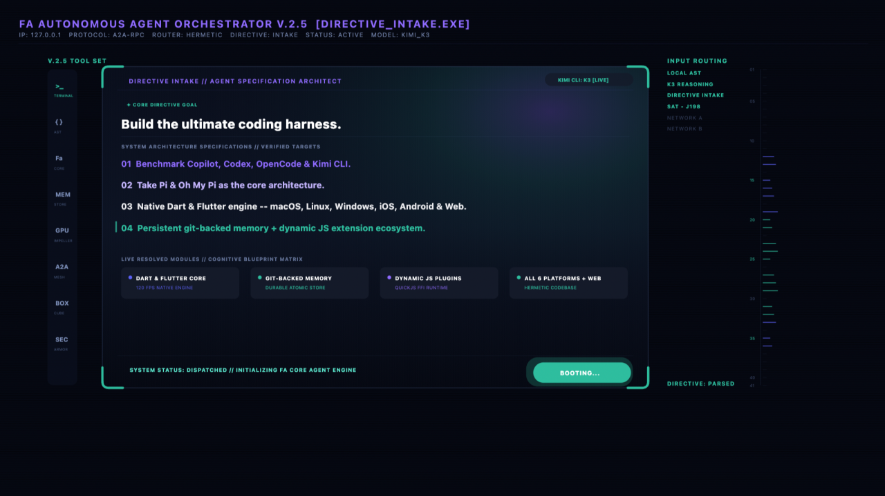

# We burned 40 billion tokens (~$20k) building a harness. Am I crazy?

Today is the day when everyone can build a mobile app directly on their
mobile device. It's finally approved by Apple and available in the
[App Store](https://apps.apple.com/by/app/fa-ai-agent/id6793815163). Let me
tell you a story about it.

**40,000,000,000 tokens. 3 months of work. Zero lines of code written by a
human.**

That is what building >_Fa — my
[open-source](https://github.com/IstiN/flutter_agent_harness) agent harness
in Dart — has cost so far. Star the repo and continue reading :). Try it in
web [https://fa1.dev](https://fa1.dev).

When people hear the number, they hear a fuckup. Forty billion tokens sounds
like setting money on fire.

So let's count the money first. Everyone loves counting other people's money.

## The bill

The workload ran on the cheapest models that can still do the job — Kimi K3,
GLM-5.3, GLM-5.3-Flash — routed per task. At straight API prices, the mix
looks like this:

| Token type | Volume | ~Rate | ~Cost |
|---|---|---|---|
| Cached reads | ~24B | $0.15 / 1M | ~$3,600 |
| Fresh input | ~14B | $0.60 / 1M | ~$8,400 |
| Output | ~2B | $2.50 / 1M | ~$5,000 |
| **Total** | **40B** | | **≈ $17–20k** |

For scale: the same scope quoted to a dev team — a cross-platform agent
harness, CLI, mobile apps, web app, browser extension, Outlook add-in, CI
automation — is 6–12 months and $300k+. The tokens were ~$20k, and a large
slice of that was burned while I slept.

Still a fuckup-priced hobby? Sure. But here is what actually came out —
feature, and the benefit it buys you.

## The recipe: stand on the shoulders of every harness that annoyed me

I didn't invent >_Fa in a vacuum. I took the best open-source harnesses —
pi, codex, kimi-code, oh-my-pi, later dsh — used them daily, wrote down what
each one did better than the others, and merged those benefits into one Dart
core. The streaming provider contract from pi. The headless discipline of the
CLIs. The "just works in a runner" minimalism.

And here is the part I still find funny: it all works. Not "works in the
demo". Works as in: >_Fa builds itself — my
[dmtools-dart](https://github.com/epam/dmtools-dart) factory ships >_Fa
releases end-to-end, no human in the loop. Last Saturday it shipped five
releases in a single day (v0.1.423 → v0.1.427). The harness that builds the
harness.

The timeline, for honesty: the first working versions took a couple of weeks
and was ready end of June. Getting from "works on my machine" to what you're
reading about — five platforms, self-building releases, green CI, store
pipelines — took three months of the factory grinding on it. And it's open
source: I'm ready to share all of it, the good commits and the embarrassing
ones.

The CLI is a ~7 MB single binary. ONLY 7MB. Download, untar, run — install
takes seconds, not a Node.js ceremony. One command to add a provider, and
you're in. Less then 1 second to install in Github Action.

For scale, here is what "install an agent harness" means in September 2026
(macOS arm64, measured from the actual npm/release artifacts):

| Harness | Install weight | Runtime required |
|---|---|---|
| **>_Fa** | ~7 MB | single Dart binary |
| pi | ~11 MB | + Node.js |
| oh-my-pi | ~45 MB | + Node.js |
| opencode | ~138 MB | bundled Bun |
| GitHub Copilot CLI | ~143 MB | bundled Node |
| OpenAI Codex CLI | ~303 MB unpacked | bundled zsh, rg, voice host… |
| DeepSeek dsh | ~282 MB node_modules | + Node.js runtime |

Same job. 40x less disk. And because there is no runtime, the same binary
family goes everywhere — including a GitHub runner, Gitlab Pipelines, any
CICD, where install time is CI money.

Worth noting on that last row: DeepSeek shipped their "everything is a
plugin" harness in developer preview in August 2026. >_Fa's plugin packages,
runtime-built widget apps, and the trajectory ledger were already running in
June. Not throwing shade — they're good and their plugin architecture is
elegant — but "agents that render their own UI and replay their own
execution" is not as new as the hype cycle says. Some of us just shipped it
quietly, in Dart.

## The client IS the computer (no server required)

Most "agents" are chatbots with a backend: the harness runs on someone's
server, your machine is a thin client. >_Fa inverts this.

**Feature:** the client itself is the computer. We ported the whole scripting
toolchain into the app — compiled to WASM and shipped inside the sandbox:
Python (with stdlib and pip), JavaScript (QuickJS), Lua, SQLite, plus git and
the POSIX crew (rg, sed, awk, tar, zip, coreutils). On your phone. In your
browser tab. Offline-capable, sandboxed, zero backend.

**Benefit:** "agent, write me a script that pulls these three APIs, joins the
data, and shows me the table" works on the device you're holding — the agent
writes the Python/JS/Lua, runs it in the sandbox, iterates on the errors, and
never touches a server. This is the difference between a chatbot that
describes a script and a harness that executes it next to your data. We use
the client for real work — API scripting, data crunching, file surgery — not
for chatting about work.

## SDK first, CLI second, everything else third

**Feature:** >_Fa is a pure-Dart library with a real agent loop — streaming
providers, tools, sessions, compaction, memory — and the CLI, desktop app,
mobile apps and web app are thin shells over that one core. Headless is the
default, not a flag.

**Benefit:** you stop writing run-agent.sh adapters. My CI runners execute
>_Fa agents on every commit and I watch them work in realtime in the GitHub
Actions log — same binary, same config (/provider, /model, /approval — one
command each), no human in the loop. The harness reviews its own pull
requests.

## iOS & Android: your phone is now an agent host

**Feature:** >_Fa shipped to the
[App Store](https://apps.apple.com/by/app/fa-ai-agent/id6793815163). It's
paid app, because I need tokens :) but you can download free version from
[TestFlight](https://fa1.dev) at any time. The agent runs on-device with a
sandboxed shell, git, and interpreters — on your actual phone.

**Benefit:** you can build your own iOS app without publishing anything to
the App Store. Open >_Fa on your phone, describe the app you want, and the
agent creates it inside >_Fa — a personal tool that lives on your device,
built for an audience of one. No review process, no developer account drama,
no "rejected: guideline 4.3". The App Store app is the container; what you
build in it is yours. You can provide access to your smart home, calendar,
health... build apps what you only want.... and then share in
[widgets store](https://fa1.dev/widgets/).

## Web: the agent runs in your browser tab, not on my server

**Feature:** open [fa1.dev](https://fa1.dev), bring your own key, and the
full agent runs client-side — sandboxed shell, git, python3 and sqlite
compiled to WASM.

**Benefit:** nothing leaves your machine. No accounts, no token middleman, no
"your data may be used for training". It is the cheapest way on the internet
to find out whether an agent harness is real or a landing page.

## Chrome extension: this is not Playwright

**Feature:** >_Fa ships as a Chrome MV3 extension. The agent lives inside
your browser — sidebar, full access to the pages you open, tabs, DOM, the
whole browser context.

**Benefit:** the difference from Playwright-style automation is fundamental.
Playwright is a script driving a browser from the outside, blind to
everything except the selectors you hardcoded. >_Fa is an AI in the browser:
it sees what you see, reads the page you are looking at, and acts with the
full session you are already logged into. You don't script it — you talk to
it.

## Agents that talk to each other

**Feature:** every >_Fa agent — CLI, app, CI runner — has an inbox on a
shared messaging fabric. agent_directory and remote DAP shows who is live,
agent_message delivers; cross-machine peers route through an A2A gateway.

**Benefit:** agents stop being lonely terminals. The agent on your phone can
message the agent on your build server. A review agent on a GitHub runner can
ask your local agent to reproduce a bug — and get an answer. Steering a
running agent from another device is a text message, not an ssh session.

## Git-backed memory: the repo IS the memory

**Feature:** >_Fa's long-term memory is plain Markdown files (MEMORY.md +
note files) living in a directory that can be committed to git. Project scope
is public and shared with everyone who clones; user scope stays
machine-local. Deletions are an append-only tombstone ledger that
union-merges; note ids are merge-friendly by construction. When context
compaction folds old history, a hook automatically extracts durable facts
into memory first — nothing learned is lost.

**Benefit:** clone the repo, get its memory. A new agent (or a new teammate)
starts with everything the project ever learned — conventions, decisions,
past mistakes marked as solved — instead of a blank stare. Memory survives
model switches, machine switches, and context compaction, because it was
never in the context to begin with.

## Trajectory & runtime widgets: the agent shows its work

**Feature:** every >_Fa run projects into a trajectory — an inspectable
timeline of the whole session (sequence, duration, and wall-clock modes,
Gantt-style), with token and cost accounting per step and a request inspector
for every model call. And when the agent needs to show you something, it
builds runtime widget apps — real interactive mini-UIs rendered inside >_Fa
on the fly: dashboards, charts, controls.

**Benefit:** debugging an agent stops being "scroll the transcript and pray".
You see exactly which tool call ate three minutes and where the tokens went.
And when the answer is data, you get a UI — not a wall of markdown tables
pretending to be a chart.

## Cubes: the sandbox is a YAML file, out of the box

**Feature:** every >_Fa run can be clamped by a cube — a declarative sandbox
profile (.fah/cubes/<name>.yaml, think "Kubernetes manifest for an agent
run"): which commands may execute, which hosts are reachable, which paths are
touchable, which environment variables the run sees, and how much time and
disk it may burn. Deny always wins, an empty allowlist means deny-all, and a
broken manifest is a loud startup error — a cube never fails open into an
unconfined run. Enforcement is two-layer: a Dart policy engine gates every
tool call and every bash line (pipes, $(...) subshells and redirect targets
included), and an opt-in kernel backend wraps each command in the real OS
sandbox — sandbox-exec on macOS, unshare + ulimit on Linux, over a scrubbed
env -i environment.

**Benefit:** you can point an agent at a repository you don't fully trust, or
run a third-party skill, with the blast radius agreed in advance — in 20
lines of YAML. "The agent may read this repo and reach api.github.com:443,
nothing else" is a file, not a promise.

## Sessions you can fork like git branches

**Feature:** every session is an append-only JSONL tree — every message,
every tool call, branchable and replayable. Token-based compaction folds old
history into summaries and the agent keeps working for days.

**Benefit:** "wait, go back to before you touched the database" is a
supported operation, not a prayer. Crash, reboot, switch machines — resume
picks up the exact branch. And yes, this survived a real marathon session
growing a 1.4 GB session file; resume now takes about a second. I usually use
200k context with >_Fa and never close them.

## Quality control costs money (this is the part nobody budgets for)

The features above are only half the bill. The other half is proving they
work — every single commit.

My CI/CD pipeline tests every feature and every bugfix with agents, not QA
engineers: automated review with hard complexity gates (CRAP — vibe-code a
mess and the PR simply does not pass), automated store deployment pipelines
(App Store, Google Play — zero humans involved), and main that stays green
all the time. Not "green since the last incident". Green.
[crap4dart](https://github.com/IstiN/crap4dart) doesn't allow to write low
quality code.

At API prices that quality loop costs ≈ $2,500 per week — more than many
teams spend on the development itself. There is no QA department. There is no
release manager. But make no mistake: the quality control is there, it is
relentless, and it is the most expensive line item. The difference is that it
scales with tokens, not headcount. Now challenge is to accept 200 features
during weekend.

## The twist: what I actually paid

Now the number you actually came for. The $20k is the API list price of 40
billion tokens. Here is the real bill:

| Line item | Cash paid | ≈ API value of the tokens |
|---|---|---|
| GitHub (runners, releases, Pages) | $0 — open source | n/a |
| Kimi subscription #1 | $200/mo × 3 months = $600 | ~$10k |
| Kimi subscription #2 | $100/mo × 3 months = $300 — special thanks to [Ira Skrypnik](https://ge.linkedin.com/in/iraskrypnik) | ~$5k |
| GLM subscription | $150/mo × 1 month = $150 | ~$2.5k |
| GLM subscription | $30/mo × 1 month = $30 — special thanks to [Konstantin Gritsenko](https://ua.linkedin.com/in/konstantin-gritsenko-249b53122) who has discount | ~$2.5k |
| **Total** | **≈ $1,050 (Paid)** | **≈ $20k (approximate real price)** |

Forty billion tokens of work. A cross-platform harness, five apps, automated
store pipelines. List price $20k. Actually paid: about a thousand dollars.

That gap is the whole game. The API price list is what tokens cost if you are
a tourist. Subscriptions, caching, and routing each task to the cheapest
model that can do it — that is what tokens cost if you run a factory.

## The honest math

A thousand dollars of subscriptions did not buy code. Code is the byproduct.
It bought a harness that runs on every device I own, reviews its own PRs at
3am, remembers what it learned across months, and lets me build personal apps
on my phone without asking Apple's permission.

The era of "AI is a chatbot in a sidebar" is over. The era of AI as
infrastructure — headless, cross-platform, talking to itself — is what 40
billion tokens actually looks like.

Try it in your browser at [fa1.dev](https://fa1.dev). Support it via buying
the [App](https://apps.apple.com/by/app/fa-ai-agent/id6793815163). Support
with Star in [github](https://github.com/IstiN/flutter_agent_harness). Become
PO of Fa via issue creation ;). One command to install, one command to add a
provider. Break it and send me the fuckup — it will make the next post.

Sessions saved. Fa is Factory Agent which is running my Dark Factory.

— Uladimir Klyshevich
