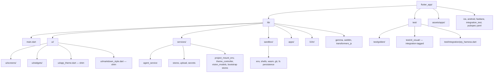
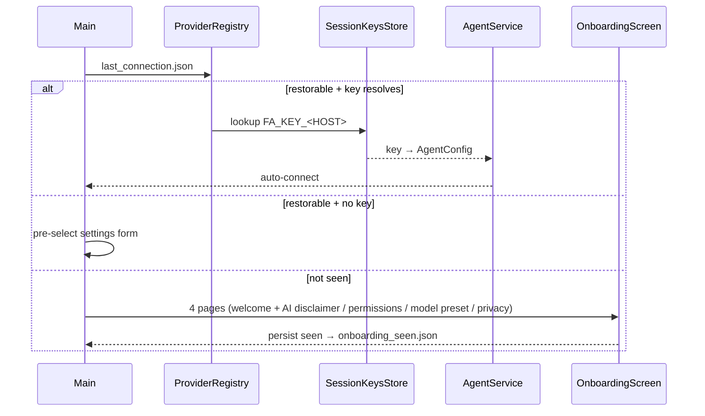

# `flutter_app/`

Flutter chat example. See [services.md](services.md) for the one-liner service table, [system-integrations.md](system-integrations.md) for HomeKit/Calendar/CodeMie SSO, [js-apps.md](js-apps.md) for the JS apps platform.

## Tree

All lib-internal imports are absolute `package:fa/...` — no relative imports.

## Key directories

- `flutter_app/lib/main.dart` — entrypoint + `BootstrapScreen`: auto-connects the restored last connection when its key resolves, else `SetupScreen`. At widths `>=` `kWideLayoutBreakpoint` (900 px) the app uses `WideLayoutShell` (sidebar + content area); below that it falls back to the launcher + `SessionChatSheet`.
- `flutter_app/lib/ui/widgets/wide_layout_shell.dart` — wide-screen shell (`>=` `kWideLayoutBreakpoint`, 900 px): `SidebarNavItem` + `SidebarSessionsList` (collapsed = icon rail) + `AppsPanel` ("My Apps" right-side) + content area hosting `ChatScreen` / setup / settings. Below the breakpoint the shell is bypassed entirely.
- Other wide-layout widgets: `apps_panel.dart` (right-side "My Apps"), `fa_mark.dart`/`model_mark.dart` (Fa brand marks), `provider_selection_list.dart` (list-based provider picker), `downloaded_models_quick_start.dart` (on-device model download helper), `code_viewer.dart`+`syntax_theme.dart` (syntax-highlighted code viewer, `re_highlight`), `html_preview_*.dart` (HTML preview with shared `<style>` injection for unstyled pages).
- `flutter_app/lib/ui/markdown_style.dart` (shim re-export of `packages/fa_ui/lib/src/chat/markdown_style.dart`) — adds `SandboxImageResolver`/`fahSandboxImageBuilder` that load markdown image bytes via `env.readBinaryFile` (memoized, dim placeholder on failure, tap → `showFahImagePreview`); `generate_image` tool tiles also render the saved image inline.
- `flutter_app/lib/ui/widgets/media_player.dart` (shim re-export of `packages/fa_ui/lib/src/chat/media_player.dart`) — `SandboxAudioPlayer`/`SandboxVideoPlayer` behind injectable `SandboxAudioController`/`SandboxVideoController` (tests inject fakes via `ChatScreen(audioControllerFactory:/videoControllerFactory:)`); real defaults wrap `audioplayers` (`BytesSource`) + `video_player` (bytes → temp file, web = "not supported"); audio/video extension fallback for any non-`read` tool result (how `generate_video` tiles render); markdown media links open `showFahMediaDialog`.
- `flutter_app/lib/ui/widgets/chat_message_tile.dart` (shim re-export of `packages/fa_ui/lib/src/chat/chat_message_tile.dart`) — the ONE transcript message renderer, shared by the chat screen + Fa chat overlay (`compact: true`): Markdown bubbles, tail-collapsed thinking, styled `[ tool ]` tiles, `$`-prompt lines, inline generated media. **Never fork message rendering** — extend this widget.
- `flutter_app/lib/ui/widgets/chat_composer.dart` (ADAPTER over `packages/fa_ui/lib/src/chat/chat_composer.dart`) — keeps the app's constructor surface (`AgentService` + `uploadPicker`/`asr`/`asrTranscriber` test fakes); bridges to shared composer hooks: `UploadPicker` → `FaChatUploadPicker`, gallery/camera via `image_picker`, ASR wrapped in `FaChatVoiceInput` (per-take media gateway → active provider fallback).
- `flutter_app/lib/ui/screens/app_launcher_screen.dart` — THE app home on every layout (`faHomeScreen` always returns it; classic sidebar chat home is legacy — `session_sidebar.dart` no longer exists, sessions live in the chat sheet's pager/menus). iOS-home-screen grid of JS apps + Settings/Files system tiles, laid out on icon-unit geometry (`LauncherGridSpec`: 56px icon + 20px label, 16px gaps, default 4 cols < 600px / 6 above / clamped 3-8) as `SingleChildScrollView` + `Stack` of `AnimatedPositioned` tiles (`packTileSpans`/`layOutTileRects`): reorders animate while dragging (center-band = folder intent, edge halves = insertion; hold-release opens tile-size menu). Folder tap = floating panel (rename/dissolve, drag-out-to-ungroup). Tile layout via `LauncherLayoutStore` (`launcher_layout.json` v2: ordered `app:<id>/system:*/folder:<id>` + `grid.columns` + `tileSizes`; v1 migrates, corrupt → defaults; `syncApps` reconciles). Stack hosts `SessionChatSheet`.
- `flutter_app/lib/apps/session_chat_sheet.dart` — session chat bottom sheet over the launcher (FaChatOverlay): collapsed = floating Fa button bottom-right (`FaWorkBar` while streaming); expanded = 92% sheet with drag-handle (title via `SessionNamesStore`, 3-dots: New / Rename / Open full chat / Collapse — Rename opens `showRenameSessionDialog`), horizontal `PageView` over `manager.sessions` → `manager.switchTo`, `FaWorkBar(embedded:)`, shared `ChatMessageTile` + `ChatComposer`. Pull-down (48px / 300px/s) collapses.
- `flutter_app/lib/ui/screens/chat_screen.dart` (ADAPTER over `packages/fa_ui/lib/src/chat/fa_chat_screen.dart`; re-exports `chatImageMessageSource` / `kWideLayoutBreakpoint`) — multi-session surface: `FlutterSessionManager` subscription (session switch hands shared screen the new active service, re-subscribes in place; `ensureActiveSession` clones fresh when last session closes) + fa hooks (`settingsBuilder` → `SettingsScreen`, `fileBrowserBuilder` → `FileBrowser`, `service.appLauncher` → `FaChatHost.appLauncher` else `pushJsApp`, `composerBuilder` → app's `ChatComposer`). Composer changes must keep goldens pixel-identical.
- `flutter_app/lib/l10n/` — gen-l10n: `app_en.arb` + `app_ru.arb` → `AppLocalizations` (generated, never edit; `flutter gen-l10n`). UI copy via `context.l10n.<key>` (`l10n_ext.dart`); locale follows system. `test/l10n_guard_test.dart` hard-fails on hardcoded widget strings, en/ru key drift, placeholder mismatches, missing keys. Opt out per line with `// l10n:ignore`, per file with `// l10n:ignore-file` (agent-facing/log strings stay literal).
- `flutter_app/test/golden/` — golden tests (see MANDATORY section in `AGENTS.md`).
- `flutter_app/test/cli_visual/` — CLI visual integration tests (integration-tagged, excluded from pre-commit `flutter test`): real `dart bin/fah.dart` runs in a PTY (`package:pty2`), every step screenshotted through real Flutter `TerminalView` (JetBrainsMono + Fa palette, `RepaintBoundary.toImage` at 2x) into `test/integration/screenshots/NN_name.png` + a `.txt` twin with xterm screen text. Run: `flutter test test/cli_visual --tags integration`. Pure-Dart counterpart in `test/integration/pty_harness.dart` (PTY/pty2 pitfalls: spawn `dart bin/fah.dart` NOT `dart run`, always cancel output subscription in `close()`).
- `flutter_app/lib/ui/screens/model_presets.dart` — settings "Model presets" section: swipeable `PageView` of `kModelPresets` cards applying a whole model combo in one tap (`applyModelPreset` — per-slot `MediaModelsStore` overrides, unmapped slots cleared, then `service.reconfigure` + `LastConnectionStore.saveFromConfig`; missing provider key = inline hint + jump to `ProviderEditorPage`, nothing applied). Add a preset by appending `ModelPreset` to `kModelPresets` plus its `modelPreset<Id>Name`/`...Description` arb keys; `ModelPresetTarget` is sealed for future custom/on-device targets.
- `flutter_app/lib/sandbox/sandbox_registry.dart` — central registry of sandbox shell commands per platform; the Fa system prompt's `{{commands}}` renders from it. **Never list commands in prompt text or UI by hand.**
- `flutter_app/lib/services/project_mount_env.dart` — macOS project-folder mount (`/project` → user-picked host dir; security-scoped bookmarks in `project_mount.json`; stale bookmark = "pick again" warning).

## App boot

## macOS window chrome

`MainFlutterWindow.swift` uses the modern unified titlebar (`titlebarAppearsTransparent`, hidden title, `fullSizeContentView`, `toolbarStyle = .unifiedCompact`, window background `#070A10`; deployment target 14.0 in `project.pbxproj`), so the compact traffic lights float over Flutter content; `MaterialApp.builder` in `main.dart` reserves a 28px top strip on macOS so they never overlap the app header.

## JS extensions

`flutter_app/lib/services/ext/` hosts the app side of the JS-extension
stack (issue #32): `AppExtensionService` owns the on-device store roots and
the `JsExtensionHost`; engines are flutter_js (native) and a web worker
(web). v1 scope: trusted-only load — there is NO trust prompt/UI yet, so
untrusted extensions tombstone-skip (`untrusted`) and never run; install
management happens through the CLI. Authoring guide and API reference:
[js-extensions.md](../js-extensions.md).
