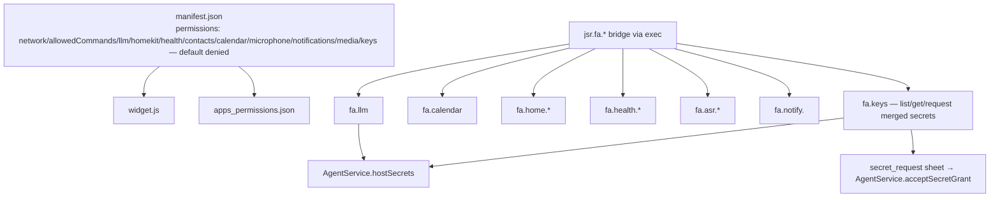

# JS apps platform

`flutter_app/lib/apps/` runs on `package:js_widget_runtime` (git-pinned; SIGSEGV guards are not in pub yet). Apps live in env-shared `apps/<id>/{manifest.json, widget.js}`; the `js-apps` skill seeds into `.fah/skills/` on startup.

## Runtime pinning

| Package | Pin | Fix |
| --- | --- | --- |
| `flutter_js` | `IstiN/flutter_js@74a11bf` | fix-jscore-multi-instance: routes native sendMessage by executing context, refuses post-dispose evaluate |
| `flutter_js_widget_runtime` | `IstiN/flutter_js_widget_runtime@9498d0c` | queued-callEvent-after-dispose guard + restart-safe bridge channels; `js_app_engine.dart` enforces process-wide lifecycle serialization — releases must stay immediate, never deferred |

`package:js_widget_runtime` ≥ 0.4.5 adds the `map` node: center/zoom/markers/polylines/`fitBounds`, `onTap`/`onMarkerTap`. `open_app_tool.dart` registers the agent tool `open_app` (host callback navigates via `js_app_navigation.dart` `pushJsApp`).

## Bundled demos

Demo seeding is **ownership-aware**: `apps/.demo_seeds.json` records sha256 of each file — content that no longer matches is user/agent-owned and never overwritten (UNLESS on-disk manifest is unparseable: a half-written skeleton is re-seeded, not protected — it bricks the tile). `resetDemoApp(id)` force-restores the reference version, `storage.json` untouched. A failing seed lands in `AppsStore.failedSeeds` (id → error text) with an error badge; tapping shows a dialog with the copyable error. Bundled demos (`AppsStore.demoAppIds`, assets in `flutter_app/assets/apps/`; each id MUST also have its `- assets/apps/<id>/` pubspec entry, gated by `test/apps/demo_assets_declared_test.dart`):

| id | kind | notes |
| --- | --- | --- |
| `calculator` / `weather` / `stocks` / `crypto` / `animation-showcase` / `yolo-hello` | basic | — |
| `calendar` | `jsr.fa.calendar` | — |
| `contacts` | `jsr.fa.contacts` | iOS/macOS system contacts (search / detail / add); permission gate; uses `contact_service_io.dart` over `fah/contacts` channel |
| `map` | `map` node | center / zoom / markers / polylines / `fitBounds` |
| `health` | real bridge on iOS, honest demo-panel fallback elsewhere | HomeKit demo too |
| `homekit` | demo panel fallback outside iOS | — |
| `voice-notes` | `jsr.fa.asr.*` | iOS/macOS microphone record → local transcript list (`voice-notes` permission); backed by `asr_service_io.dart` + `fah/mic` channel |
| `reminders` | `jsr.fa.notify.*` | iOS/macOS local notifications (schedule / cancel list); uses `notify_service_io.dart` over `fah/notify` channel; `widget` 2x2 tile |
| `fitness-trainer` | `scene3d` + flame_3d | 3D coach from NAVER's anny body model (Apache-2.0) baked to `coach_anny.glb` with 10 skeletal clips; baker at `references/anny/tools/bake_coach_glb.py` — anny `local-bone` deltas in world axes → glTF: IBMs column-major, mesh split into ≤16-joint surfaces, skinned node NOT parented to a joint (flame_3d dependency count then never settles); START-driven exercise/rest steps via `scene3d` + `jsr.storage`; `integration_test/fitness_coach_screenshot_test.dart` verifies on macOS |
| `english-teacher` | "Language Tutor" | Duolingo-style quiz (hearts/XP/streak, choice + typing), per-language offline word bank (en/de/es/fr/pl via `jsr.storage`), LLM-generated extra words via `jsr.fa.llm.chat` (manifest `llm: true`) |
| `3d-game` | `scene3d` + `jsr.scene3d.*` | engine's `JsRuntimeConfig` and both renderers (`JsAppView`, `AppTileHost`) wire `js3dHost: createJs3dHost()`; tap picking flows back via `dispatchHostEvent('scene3d.tap:<id>')` |

## Live launcher tiles

A manifest `"widget"` section (`{entry: 'widget_tile.js', size: 'WxH', refreshSeconds?}` → `JsAppInfo.tileWidget`; size in icon-slot cells, W 2–4 × H 1–4, default 2x2) makes the launcher grid render `app_tile_host.dart` (a `JsAppEngine` on the tile entry, display-only — any tap opens the app) instead of the static icon tile; a W×H tile's edges align exactly with the W×H block of icon slots it replaces. Users resize via hold-release menu (writes `tileSizes` into `launcher_layout.json`); the same menu offers demo apps "Restore reference version" (`AppsStore.resetDemoApp`, `storage.json` untouched).
