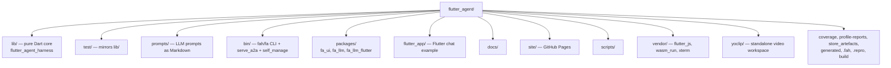
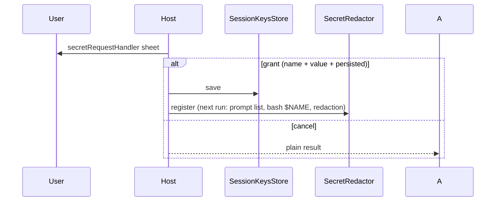
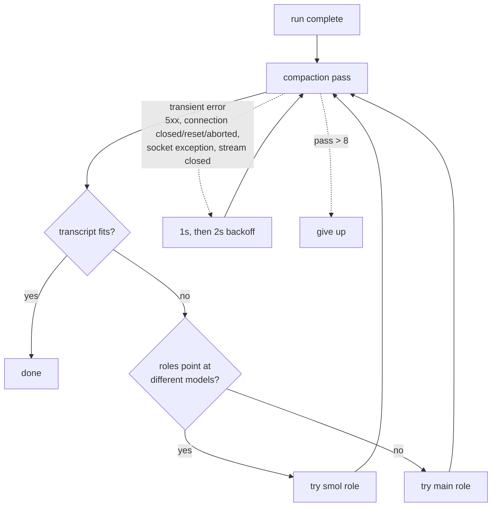
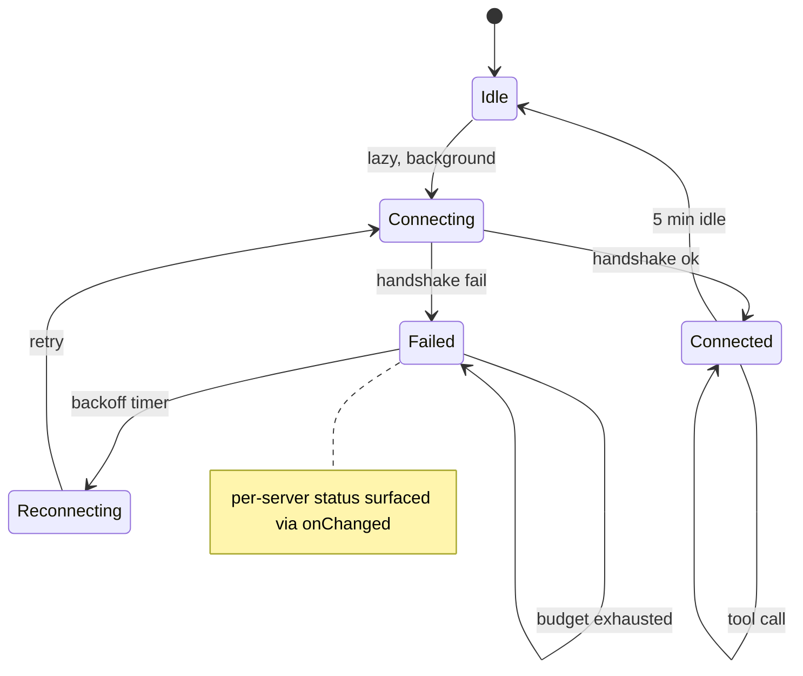
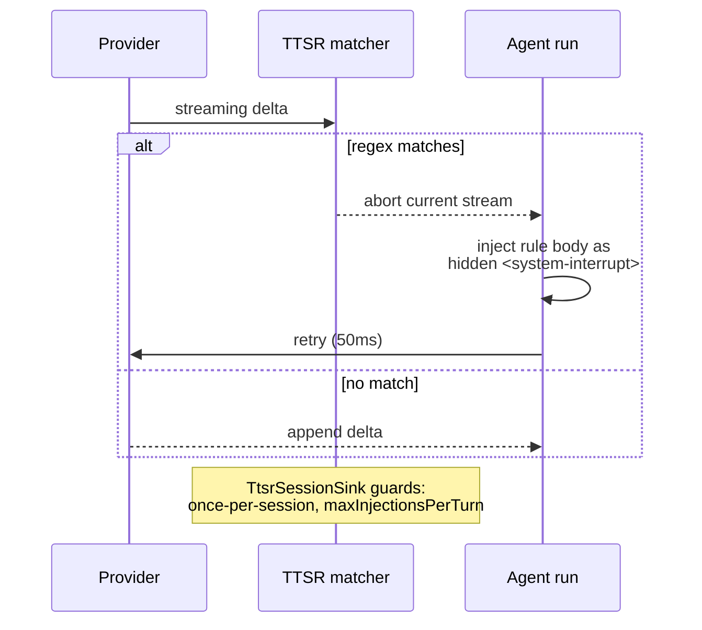
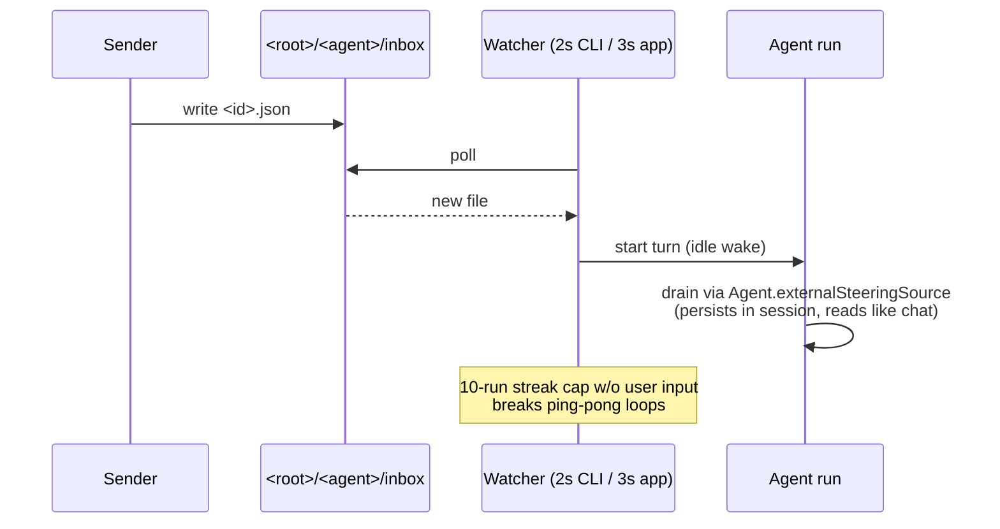

# Project layout

Reference for the `lib/`, `packages/`, `bin/`, `prompts/` subsystems. The Flutter app and its JS apps platform live in their own docs:

- [flutter-app.md](flutter-app.md) — chat example, services, widgets
- [js-apps.md](js-apps.md) — JS apps platform, demo apps, runtime pinning
- [services.md](services.md) — Flutter app services one-liner
- [system-integrations.md](system-integrations.md) — HomeKit, Calendar, CodeMie SSO
- [cli.md](cli.md) — `fah`/`fa` CLI machinery, `/settings` hub, provider catalog
- [providers.md](providers.md) — provider auth flows (chatgpt / codemie / dial / openrouter)
- [fa-ui.md](fa-ui.md) — `packages/fa_ui/` reusable Flutter package

## Top-level tree

- `lib/` is **pure Dart** (compiles for web; no `dart:io` — only `bin/` and `lib/io.dart` are IO entry points). `lib/src/` subsystems:

## Core tools / sinks

- `lib/src/approval/` — tool approval gate: tiers `read`/`write`/`exec`, session modes `always-ask`/`write`/`yolo`, per-tool overrides, critical-pattern `bash` interceptor. `attachApproval` runs first in `beforeToolCall`; UI is an injectable `ApprovalPrompt` (null + prompt policy = deny).
- `lib/src/tools/ask_tool.dart` — `ask` tool: structured mid-turn questions via injectable `AskCallback` (null = error, cancel = plain result).
- `lib/src/tools/request_secret_tool.dart` — `request_secret` tool: agent asks the user for a missing credential via injectable `RequestSecretCallback` (never in chat text). Grant returns `RequestSecretResult` (host-adjusted `name`, `value`, `persisted`); decline is a plain result.
- `lib/src/tools/generate_image.dart` — `generate_image` tool: pure-Dart image generation saving PNG into sandbox `generated/`. Two dialects: OpenAI-compatible `POST {base}/images/generations` (default) and MiniMax `POST {base}/image_generation` (detected by `minimax` baseUrl). Bytes never enter chat context — only path + base64-staged `ImageContent`. Web-safe.
- `lib/src/tools/inspect_image.dart` — `inspect_image` tool: dedicated vision-capable model analyzes a local image and returns text. Image payload never enters chat context.
- `lib/src/tools/transcribe_audio.dart` — `transcribe_audio` tool: Whisper-compatible `/audio/transcriptions` (OpenAI / Groq / OpenRouter / local whisper.cpp). Pure-Dart `package:http` multipart. 25 MB cap. Audio never enters chat context.
- `lib/src/tools/tool_format.dart` — tool result formatting helpers shared by media/shell tools.

- `lib/src/env/session_vars_execution_env.dart` — `SessionVarsExecutionEnv`: `ExecutionEnv` decorator injecting `FAH_SESSION_ID`/`FAH_SESSION_FILE`/`FAH_PROVIDER`/`FAH_MODEL` (resolved live per `exec`, never secrets) into bash. Wired around `builtinTools` in `AgentCli` + `AgentService`. `LocalShell` merges `ShellExecOptions.env` OVER `Platform.environment` (never replaces).
- `lib/src/env/memory_execution_env.dart` — `MemoryExecutionEnv`: pure-Dart in-memory `ExecutionEnv` (POSIX `/`-paths, default `Shell = UnavailableShell` reporting `shellUnavailable`). Default for tests and web consumers; shell-backed variants use `LocalShell` instead.
- `lib/src/tools/checkpoint_tool.dart` — `checkpoint`/`rewind` tools for context hygiene. `CheckpointRewindController` wraps `Agent.prepareNextTurn`, persists via host `CheckpointSessionSink`.
- `lib/src/compaction/branch_summarization.dart` — `generateBranchSummary` + `navigateSessionTree` (use instead of `Session.moveTo` for tree navigation). Summary is a `branch_summary` record on the entered branch.
- `lib/src/agent/auto_compactor.dart` — **single source of truth** for post-run compaction. **never re-implement auto-compaction in the host**; add hooks to `AutoCompactorHooks`.

## Patch / read

- `lib/src/hashline/` — hashline patch language: `[path#TAG]` headers (4-hex xxHash32 of whole file), `SWAP`/`DEL`/`INS.*` ops, all-or-nothing `HashlinePatcher`. Stale tags reject before any write. `edit` takes `patch`, `read` takes `hashline` flag.
- `lib/src/tools/read_selector.dart` — `read` trailing selectors: `:N`/`:A-B`/`:A+C` (`..` alias), comma multi-ranges, `:raw`. A literal file named `x:1-2` wins over the selector. `offset`/`limit` must not be combined with a selector.
- `lib/src/tools/archive_reader.dart` — `read` inside archives (`a.zip:inner/entry`, `.tar`, `.tgz`), 256 MiB cap.
- `lib/src/tools/sqlite/` — `read` SQLite targets (`db.sqlite`, `:table[:key][?params]`, `?q=SELECT`). FFI engine (`package:sqlite3`) via `builtinTools(env, sqlite:)`; without it a clean "not supported" note.

## Protocol tooling

- `lib/src/lsp/` — `lsp` tool (diagnostics/definition/references/rename): pure-Dart JSON-RPC over `LspTransport`; `.dart` → `dart language-server --protocol=lsp`; projects merge `.fah/lsp.json`. Lazy start, 5-min idle shutdown, crash respawn with backoff. Renames apply all-or-nothing through the env. IO via `lib/io.dart` + `builtinTools(env, lsp:)`. 1-indexed line/character; missing server = clean note, never a crash.
- `lib/src/mcp/` — MCP servers from `mcp:` section of `~/.fah/config.yaml` (strict `ConfigException` parsing). Stdio (`command`/`args`/`env`, NDJSON — **NOT** LSP's Content-Length) and remote (`url`, streamable-http default or legacy sse, `headers`). Message-level `McpTransport`; stdio framing pure Dart over `McpByteChannel` (process via `lib/io.dart`), HTTP transports pure Dart over injectable `package:http` (web gets remote; stdio = "not supported"). `McpManager` connects lazily in background, per-server `connecting`/`connected`/`failed` status, reconnect with capped backoff. Tools register as `mcp__<server>__<tool>` (exec tier, description prefixed with origin, inputSchema verbatim). Results map MCP blocks onto ours; `isError` throws; timeouts `mcp.toolCallTimeoutMs`.

## Providers / models

See [providers.md](providers.md) for the full provider catalog.

- `lib/src/model_roles/` — roles `default`/`smol`/`slow`/`plan` with fallback chains, key rotation (`ApiKeyRing` over `NAME`/`NAME_2`/…), 429 mid-turn take-over (`FallbackStreamFunction`, **never silent**). Watchdogs (`provider_common.dart`): `providerConnectTimeout` 60s, `providerStreamIdleTimeout` 120s between bytes — wedged endpoint errors out so the resolver can fail over. Config: `roles:`/`modelOverrides:`/`retry:` in `~/.fah/config.yaml` (invalid schema = `ConfigException`). Shared models: `media_model_slots.dart` (shared with app's `MediaModelsStore`) and `models_config.dart` (per-slot media overrides + named custom model definitions `/model <name>` resolves; persisted by host).
- `lib/src/ttsr/` — time-traveling stream rules: regex matched against streaming deltas; on match abort, inject rule bodies as hidden `<system-interrupt>` message, retry after 50ms. Persisted via `TtsrSessionSink`. Guards: once-per-session, `maxInjectionsPerTurn`. Config: `ttsr:` in `~/.fah/config.yaml` + project `.fah/rules.yaml`.

## Skills / context

- `lib/src/skills/skills.dart` — agent skills: `<root>/<name>/SKILL.md`, roots project (`.fah/skills`, `.agents/skills`) > user (`~/.fah/skills`, `~/.agents/skills`), first-name-wins. Only metadata enters the system prompt; bodies loaded via `read`.
- `lib/src/prompts/project_context.dart` — `AGENTS.md`/`CLAUDE.md`/`GOAL.md`/`DESIGN.md` auto-merged into the system prompt: cwd → git root, farthest-first, `<!-- From: -->` annotations, 32 KiB leaf-first budget; optional `~/.fah/AGENTS.md` first. CLI: `/skill:<name> [args]`, `/skills`.

## Subagents / messaging

- `lib/src/task/` — `task` tool: parallel subagents, batch `{context, tasks[]}` + `background`; children never get `task` (no nesting); `explore`→`smol`, `review`→`slow`; `outputSchema` ONE fix retry; child failure = per-item error. `/tasks` lists jobs, `/tasks cancel <id>`; completions re-enter parent as async-result (`agent://<id>`). Subagents retained: real JSONL child sessions, `task_status`/`task_observe`/`task_send`, child-only `reply` + sibling `agent_message` (pending-queue + hop-capped), `completed_without_reply` notice.
- `lib/src/messaging/` — messaging fabric: every agent owns a file inbox behind the `MessagingRepository` interface (`send`/`peek`/`drain`/`directory`). `FileMessagingRepository` over `ExecutionEnv`: `<root>/<agent>/inbox|read/<id>.json`, timestamp-ordered, sanitized dirs, torn writes skipped. `mailboxPrefix` namespaces mailboxes — ids with `/` are absolute cross-instance addresses (`<sessionId>/main`). `agent_message` targets siblings/main/absolute; `agent_directory` lists with pending counts (`.id` markers keep real ids). UI: `/agents` rows show `mail:N` (no ✉ in CLI font), app's `AgentsSection` shows `✉N`.

- `lib/src/memory/` — long-term memory: `MemoryController` over `flutter_agent_memory` (hosted pub.dev), `execution_env_kb_storage` (KbStorage → ExecutionEnv), `memory_add`/`memory_search`/`memory_list` tools (`memoryTools(controller, onChanged:)`), and `<memory>` prompt section (`formatPromptSection()` BOTH scopes; entities via `KBFileParser` — raw file's first line is the `---` delimiter) cached by host, recomposed after startup + on every `memory_add` (CLI `_refreshMemorySection`, app `AgentService`). Phase 2: `compaction_memory_hook` (smol role, non-blocking), `maintain()` (levels + consolidate, 24h stamp), triggers on session start + `/memory maintain`.
- `lib/src/a2a/` — A2A (Agent2Agent) interop: `a2a_client.dart` (Agent Card + JSON-RPC + SSE), `a2a_config.dart` (`a2a:` yaml section, `${NAME}` env tokens), `a2a_manager.dart` (lazy per-server connect, A2A task state → subagent lifecycle), `a2a_server.dart` (request handler). `task` agent type `a2a:<name>` runs remote agents as subagents; `/a2a` shows server status; `fa serve --a2a [--port N] [--token T]` mounts as endpoint (`bin/serve_a2a.dart`).

## CLI

See [cli.md](cli.md) for full CLI machinery and the `/settings` hub.

## `packages/fa_ui/`

See [fa-ui.md](fa-ui.md) for the full reusable widget package.

## `flutter_app/`

See [flutter-app.md](flutter-app.md) for the chat example structure, shim re-exports, and widgets.

## Other

- `docs/subagents/` — the subagents-2.0 + long-term-memory master plan (phased: memory package publish, memory foundation, memory-aware compaction, session-backed retained subagents, agent-type menu); update the checklists there as work lands.
- `site/` — static GitHub Pages landing; `.github/workflows/pages.yml` builds the web demo into `app/` (never committed). `site/privacy.html` is the published privacy policy (`PRIVACY.md` in the repo root is the source text — keep both in sync; the onboarding privacy page links to `https://fa1.dev/privacy.html`).
- `scripts/` — codegen and quality-gate scripts.
