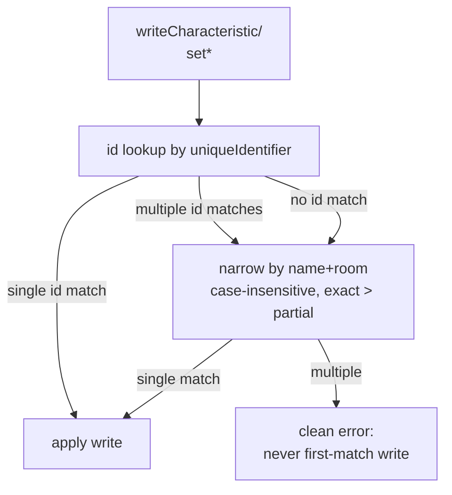
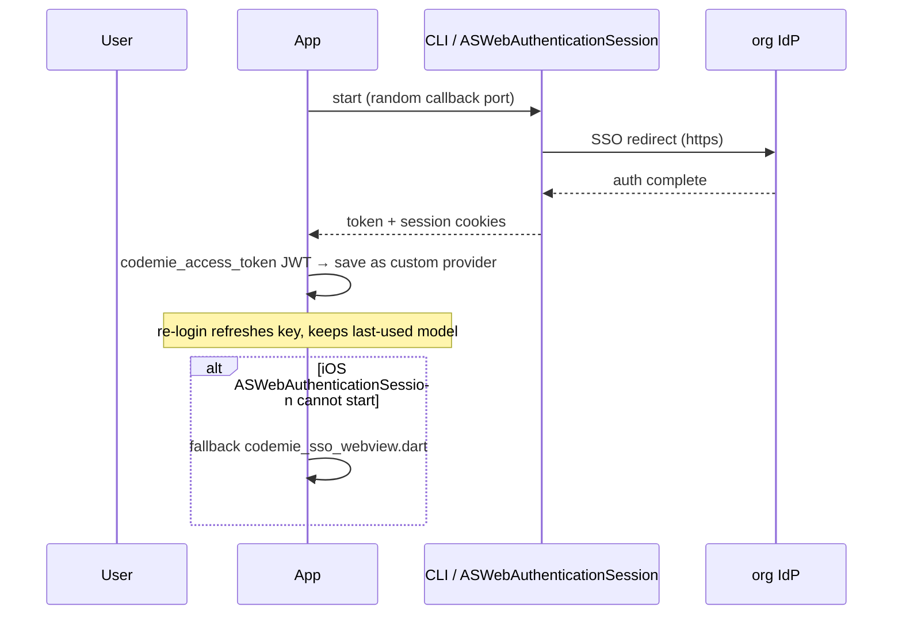

# System integrations

Detailed docs for the larger Flutter app services. See [services.md](services.md) for the one-liner table.

## `flutter_app/lib/services/home_service.dart`

Smart home: `HomeApi` over the `fah/home` MethodChannel (HomeKit in `AppDelegate.swift`, iOS only; macOS = unsupported). Methods: `listHomes`/`listRooms`/`listAccessories` (full services/characteristics + `isOn`/`brightness`/`targetTemperature`), `readAccessory`, `writeCharacteristic` (ANY writable by HomeKit type string), `listScenes`/`executeScene`, `setPower`/`setBrightness`/`setTargetTemperature` aliases. Delegate waits for first `homeManagerDidUpdateHomes` (5s cap) + polls authorization so a denied prompt answers `false` instead of hanging. All four writes take optional `name`/`room`: bridge sub-devices (Aqara/Mi) can share ONE `uniqueIdentifier`, so native write routing narrows id matches by name+room (case-insensitive, exact > partial) and falls back to a name+room match when the id matches nothing; still-ambiguous = clean error, **never a first-match write**. JS surface `jsr.fa.home.*` mirrors it (`docs/js-system-apis.md`); agent tools in `home_tool.dart` (`home_devices`, `home_turn_on`/`home_turn_off`, `home_set`) — `match` accepts name or full UUID, optional `room`/`home` args narrow duplicates (ambiguity error teaches both escape hatches); `home_devices` shows each accessory's short id (first 8 chars).

## `flutter_app/lib/services/calendar_service.dart`

`CalendarApi` over the `fah/calendar` MethodChannel (EventKit in `MainFlutterWindow.swift`/`AppDelegate.swift` — **MIRRORED, edit both**; entitlement `com.apple.security.personal-information.calendars`, both `NSCalendars*UsageDescription` plist keys); stub = not-available on web. Agent tools in `calendar_tool.dart` (when `calendarPlatformSupported`): `calendar_events {date?, days?}` (rows carry recurrence/alarm/url hints), `calendar_calendars` (title, source account, writable), write-tier `calendar_add`/`calendar_update`/`calendar_delete`. Writes support `recurrence` ({frequency, interval?, daysOfWeek? MO..SU weekly-only, daysOfMonth? monthly-only, until|count — at most one end; validated by `parseCalendarRecurrence`, removed via `'none'`/`{}`), `alarms` (minutes before start; replace-on-update), `calendar` (target calendar title), `span` (`this`/`future` → `EKSpan`) on update/delete, `url`. Denial result points to System Settings → Privacy → Calendars. `jsr.fa.calendar` bridge (`js_app_engine.dart`) passes the same fields through.

## CodeMie SSO in the app

`lib/services/codemie_sso_flow.dart` — macOS uses the CLI flow (local callback server + system browser), iOS drives `ASWebAuthenticationSession` through the `fah/web_auth_session` channel in `ios/Runner/AppDelegate.swift` (Safari-grade WebAuthn/passkey — an embedded `WKWebView` cannot offer Face ID without a `webcredentials` associated-domain relationship with the IdP; the session intercepts the `http://localhost:<port>/?token=` redirect by its `http` scheme, every flow page being https). When the session cannot start, the flow falls back to `ui/screens/codemie_sso_webview.dart` (in-app `webview_flutter` page intercepting the same redirect via `NavigationDelegate`, password login only).

