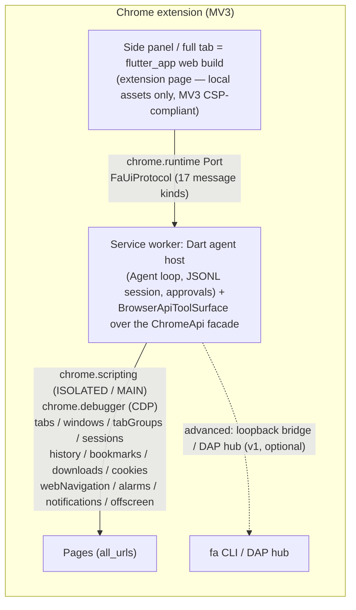

# Browser extension (`browser_ext/`)

How the [fa](../README.md) agent lives in a real Chrome: since v2.1 the
extension **hosts the fa web app** (side panel + full tab) and grants the
agent the full Chrome extension API surface as tools — with the v1
loopback bridge / DAP machinery demoted to an advanced, optional path.
This page is the architecture + operations guide. The extension's own
README ([browser_ext/README.md](../browser_ext/README.md)) covers the
operator view; per-permission store-review justifications live in
[docs/browser-extension-permissions.md](browser-extension-permissions.md);
tool availability config in
[docs/tool-availability.md](tool-availability.md).

## Overview — one product

The panel is the app, not a second chat. `panel/panel.html` is a
bootstrap that loads the bundled Flutter web build from `app/` when
present (built by `scripts/build_browser_ext.sh --with-app`) and falls
back to the v1 legacy chat UI when absent. The agent always runs inside
the MV3 service worker; the panel is its face.

| | **App panel** (`--with-app`) | **Legacy fallback chat** |
|---|---|---|
| UI | The real fa web app (chat, sessions, settings, provider flows), local assets only (MV3 CSP) | v1 minimal panel: pairing, provider form, approvals, event log |
| Agent | Service worker (Dart core, `sw/agent.js`) | Same |
| Link UI↔SW | `chrome.runtime` port — `FaUiProtocol` | Direct panel API over `chrome.runtime` messaging |
| When | `browser_ext/app/` exists | Otherwise |

Status: the app-hosting panel currently runs the app's own local agent
path — the app-side worker-relay chat integration is pending (see
[Status](#status--limitations)); the SW protocol server below is ready
for it.

## Architecture



Load order in the service worker is fixed (`sw/main.js`): `tabs.js` →
`bridge.js` → `ops.js` → `cdp.js` → `agent.js` (dart2js output of
`browser_ext/dart/agent_main.dart`; optional — absent means scaffold
mode). Everything is a classic script on the `globalThis.faSw`
namespace; the agent binds `globalThis.faAgent`
(boot/sendUser/onEvent/decide/pushMail/getState/selfTest). MV3 classic
service workers have no ES modules and dart2js output is classic too.

The Dart side is layered pure Dart (no `dart:io`, no `js_interop` in
the layers that matter):

| Layer | File(s) | Role |
|---|---|---|
| UI protocol | `dart/src/ui_protocol.dart` | The 17-kind UI↔SW envelope codec (below) |
| UI transport | `dart/src/ui_transport.dart` | `WorkerRelayTransport` (extension) vs `LocalStreamTransport` (plain web), capability detection, backoff reconnect + offline queue |
| Port server | `dart/src/ui_port_server.dart` | SW-side multiplexing: one agent, many port clients; prompt-id dedup + attach replay |
| Tool surface | `dart/src/browser_api_tools.dart` | 34 tools over the facade; restricted-page rule, result budgets, gates |
| Chrome facade | `dart/src/chrome_api.dart` + `fake_chrome.dart` | Typed `ChromeApi` over 23 chrome.* groups; coded `ChromeApiException`; deterministic fake |
| Permissions | `dart/src/permission_matrix.dart` | The declarative permission⇄tool table + two-way checker |
| Background | `dart/src/background/` | Badge, AlarmScheduler, OffscreenManager, EntryPointHub |
| Security | `dart/src/security/` | Quarantine classifier, injection validator, exfil gate |

## FaUiProtocol — the UI↔SW contract

Extension-internal messaging over a `chrome.runtime` Port — no network.
Wire version 2 (oldest negotiable: 1); `hello`/`hello_ack` negotiate
before any other traffic. 23 message kinds:

| Kind | Direction | Fields / notes |
|---|---|---|
| `hello` | UI→SW | `protoVersion`, `capabilities` — versions first |
| `hello_ack` | SW→UI | agreed `protoVersion`, `serverCapabilities`, `sessionId` (null → attach follows) |
| `attach` | UI→SW | `sessionId` (null = fresh), `lastEventId` — ask for replay of missed events |
| `attached` | SW→UI | `sessionId` + ordered `replay` of events newer than `lastEventId` |
| `prompt` | UI→SW | `id`, `text` — `id` deduped SW-side (E30: a replayed prompt runs once) |
| `steer` | UI→SW | mid-turn steering text |
| `cancel` | UI→SW | cancel the running turn |
| `stream` | SW→UI | one live agent event, relayed **verbatim** (same reference — no rebuild) |
| `message_done` | SW→UI | the turn's final assistant message |
| `approval_request` | SW→UI | `id`, `call`, `reason` |
| `approval_response` | UI→SW | `decision` + optional `updates` (allow-with-edits) |
| `sessions_query` | UI→SW | list known sessions |
| `sessions_result` | SW→UI | the session list |
| `settings_query` | UI→SW | read settings |
| `settings_put` | UI→SW | merge settings into the stored set |
| `settings_result` | SW→UI | current settings (answer to either settings message) |
| `tools_state` | SW→UI | the SW agent's tool list with enabled flags |
| `tools_put` | UI→SW | apply per-tool enabled flags (panel Tools toggles) |
| `ping` | UI→SW | link keepalive (an open port does not keep the SW alive) |
| `pong` | SW→UI | keepalive answer |
| `ext_request` | UI→SW | `id`, `op`, `params` — one-shot host capability (below) |
| `ext_result` | SW→UI | `id`, `ok`, `data`/`error` — matched by `id` |
| `error` | both | the ONLY failure channel: `unknown_kind`, `malformed` |

### The ext_request op surface — panel-only host capabilities

The panel is an extension page and may use capabilities a web page
cannot; the SW serves them as one-shot `ext_request` ops (every op
validates its params and answers a structured `ext_result`):

- `cookies.get_all` (`url`/`domain`) — a scoped read of the user's LIVE
  cookie jar. This is how CodeMie signs in: the browser jar IS the
  credential, no API key and no localhost SSO dance.
- `fetch` (`url` http(s)-only, `method`, `headers`, `body`) — one HTTP
  round-trip from the SW. MV3 + `<all_urls>` host permissions mean no
  CORS and (via `credentials: 'include'` in the SW's fetch client) the
  cookies ride along — provider endpoints like CodeMie's
  `/code-assistant-api/v1/llm_models` answer with the user's session.
- `tabs.create` (`url`) — open the provider's login page for an
  interactive sign-in.

Panel flow (`codeMieLogin`): probe `llm_models` → `200` = cookies alive
(model ids surface, the key field stays EMPTY); `401/403` → open the
login tab and re-probe until the jar holds a session (bounded wait).
The SW routes a CodeMie base URL (`isCookieAuthUrl`) DIRECT to the
openai-like adapter — never through the bridge relay, which would strip
the cookies and 401.

The extension-hosted **fa app** signs in the same way: its CodeMie flow
detects the extension host, opens the login tab, and polls the same
endpoint via `extFetchString` (`credentials: 'include'`) — no webview,
no localhost callback, no key. Desktop/mobile keep the SSO-redirect
flow; the plain web build (no `chrome.runtime.id`) still refuses.

### UI↔SW split invariants

- **The UI holds no keys and makes zero provider fetches** in extension
  mode: all execution (LLM connects, streaming, tool runs) lives in the
  service worker. `detectTransport` picks `WorkerRelayTransport` when a
  port factory answers (the JS shim probes `chrome.runtime?.id`),
  `LocalStreamTransport` otherwise — the chat/settings code cannot tell
  the difference (E31).
- **The SW survives the panel.** The worker owns the Agent loop and the
  JSONL session; a restarted worker adopts the still-open UI via
  `attach`, replaying missed stream events (`lastEventId`).
- **Reconnect is disciplined**: port drop → backoff
  `[100ms, 500ms, 2s, 5s, 15s]`, reopen → hello → attach → flush the
  offline queue; composed-but-unsent text survives; double-send is
  impossible (prompt-id dedup, E30).
- **Decode never throws.** Any byte garbage decodes to a structured
  `error` — a desynced or hostile peer degrades into a visible message,
  never a dead listener.

## The tool surface — 36 tools

`browser_api_tools.dart` maps Chrome's extension APIs onto a documented
tool set over the typed `ChromeApi` facade (23 chrome.* groups; every
raw chrome failure crosses it as a coded `ChromeApiException` —
`no_tab`, `restricted_page`, `quota_exceeded`, …). Approval tiers are
metadata (`read` / `write` / `exec`); enforcement lives in the host
approval gate.

| Family | Tools | Tier |
|---|---|---|
| Tabs (9) | `tabs_open` `tabs_close` `tabs_update` `tabs_query` `tabs_move` `tabs_group` `tabs_ungroup` `tabs_reload` `tabs_discard` | query read; rest write |
| Windows (4) | `windows_open` `windows_update` `windows_close` `windows_list` | list read; rest write |
| Groups (2) | `groups_update` `groups_close` | write |
| Sessions (2) | `sessions_recent` `sessions_restore` | read / write |
| History (1) | `history_search` | read |
| Bookmarks (4) | `bookmarks_list` `bookmarks_add` `bookmarks_update` `bookmarks_remove` | list read; rest write |
| Downloads (3) | `downloads_start` `downloads_search` `downloads_cancel` | search read; rest write |
| Cookies (3) | `cookies_get` `cookies_set` `cookies_remove` | get read; rest write |
| Injection & CDP (4) | `inject_js` `inject_css` `cdp_eval` `page_screenshot` | see below |
| App & navigation (2) | `app_screenshot` `nav_wait` | read |
| Scripting (1) | `run_script` | exec |

- **`run_script` — sandboxed interpreters, web-app parity.** The SW
  cannot spawn processes and extension CSP forbids remote scripts, so
  `run_script(language, code)` runs `python` (pyodide, WASM CPython)
  and `javascript` (quickjs-emscripten) inside the MV3 offscreen
  document (`offscreen.html` + `offscreen/interpreters.js`), with the
  runtimes **vendored into the bundle** (`vendor/interpreters/`,
  downloaded by `scripts/vendor_interpreters.sh` at build time — the
  same versions the web app sandbox loads from a CDN). The SW side is
  `browser_ext/dart/src/run_script_tool.dart` (pure Dart, VM-tested);
  the chrome hops are the typed `OffscreenApi` facade plus one
  `chrome.runtime.sendMessage` bridge in `chrome_api_js.dart`. The
  document is created lazily on first call (reason `WORKERS`) and
  shared with background DOM extraction; a `document_exists` race is
  adopted, never an error. Script-level failures (a python traceback,
  a JS exception) come back as the tool RESULT (`ok:false` + the
  interpreter's error text) so the model can fix the script — only
  transport failures raise. The first python call boots pyodide
  (~10 MB wasm) and takes a few seconds; the interpreter then stays
  warm for the document's lifetime.

### The generic chrome.* bridge (issue #137)

Two tools expose the WHOLE declared chrome surface — everything the
manifest grants, not just what has a curated wrapper — so the next
browser capability is usable today with zero new tools and zero
releases:

- **`browser_api_catalog`** (read tier) — lists the `chrome.*`
  namespaces this browser actually granted the extension, built by
  runtime reflection over the service worker's live `chrome` global.
  MV3 materializes exactly the manifest-granted namespaces, so the
  catalog is truthful by construction — an ungranted API is absent,
  never advertised. With `{namespace: "bookmarks"}` it lists that
  namespace's methods (name → declared arity), events, and child
  namespaces (`storage.local` shape).
- **`browser_api`** (`{path, args}`) — calls any
  `chrome.<namespace>.<method>(args…)` by path. Failures come back as
  `{"ok":false,"error":{code,message}}` DATA (error-as-data — the turn
  continues, the model adapts); results pass the redaction pipeline,
  are wrapped as UNTRUSTED content, and are capped at 64 KiB
  (`truncated: true` marker). A call that never settles fails loudly
  after 30 s. Callback-era APIs are settled by a promisify wrapper;
  `runtime.lastError` is mapped inside the callback.

Safety kernel (`bridge_tools.dart`):

- **Hard deny list, every mode (yolo included)**: `chrome.management.*`
  (an injected page must not be able to disable/uninstall the agent's
  own extension), `chrome.runtime.*` (the extension's own machinery),
  and `chrome.storage.*` (the extension's own `chrome.storage.local`
  holds `faProviders` with LLM API keys — provider config goes through
  the curated config tool, never raw storage) plus path validation —
  only exact `chrome.<ns>.<method>` paths, no events (`on*`), no
  prototype tricks (`__proto__`/`constructor`/`prototype`). The raw
  `faAgentV2.bridgeCall` seam rides the same static kernel.
- **Exfil gate on navigation/download methods**:
  `tabs.create/update`, `windows.create/update` and
  `downloads.download` ride the SAME visited-origins ExfilGate as the
  curated open/download tools — a URL to an origin the user never
  visited asks once (allow seeds the visited set); a deny returns
  `approval_required` as data.
- **Per-root risk map**: read/write roots (`tabs`, `windows`,
  `bookmarks`, `history`, `idle`, `system`, …) ride their tier;
  exec roots (`scripting`, `debugger`, `cookies`, `browsingData`,
  `webRequest`, `declarativeNetRequest`, `proxy`, `privacy`,
  `tabCapture`, `nativeMessaging`) prompt before EVERY call. Unknown
  or unmapped namespaces default to exec — new Chrome APIs are
  safe-by-default until mapped.
- **Exactly one prompt per exec-tier call per mode**: ask mode's
  approval matrix prompts every call already; write mode's matrix is
  silent for the static read tier, so the bridge's dynamic risk ask
  carries the exec namespaces there; yolo/unattended never prompt.
- **Yolo means trust**: in yolo every namespace executes immediately,
  the panel shows a persistent "bridge: yolo — no prompts" indicator,
  and the first bridge call of the session drops a one-time notice in
  the transcript. Every call still lands in the session/trajectory
  audit trail with full path+args — no prompts never means invisible.
- **Curated tools stay**: the stable-schema family above is untouched;
  the bridge is the escape hatch and the anti-bloat measure for the
  long tail (~100 namespaces no tool wraps). Events
  (`chrome.tabs.onUpdated`-style listeners) are NOT bridge-callable in
  v1 — persistent listeners need lifecycle management and stay
  curated.
- For page-code injection prefer `inject_js`/
  `cdp_eval`: `scripting.executeScript` through the bridge cannot
  carry a source string (MV3 CSP blocks eval; `files[]` works), while
  `chrome.debugger`-based injection IS reachable through the bridge
  at the exec tier.

Injection & CDP details:

- **`inject_js` is first-class and always prompts.** It runs
  agent-authored code in the page's MAIN world (page privileges, the
  user's session readable) or ISOLATED world (safe DOM); `allFrames`
  opt-in; results captured per frame. The host gate asks every time,
  regardless of session approval mode.
- **`inject_css`** = write tier (style, not execution).
- **`cdp_eval`** — `Runtime.evaluate` over `chrome.debugger` for
  deep/page-context work; exec tier.
- **`page_screenshot`** — CDP `Page.captureScreenshot` (any tab,
  background included).
- **`app_screenshot`** — the app's own body (panel/tab), read tier;
  captures include chat text — the user's own screen; scope
  widget-vs-full-panel keeps shots minimal (E16).

Surface policy layered on top of the facade:

- **Restricted-page rule (E1/E17)** — chrome://, extension pages,
  edge://, about:, Web Store, PDF viewer: scripting + debugger tools
  refuse with `restricted_page`; tab management still works so the
  agent can always clean up.
- **Result budget (E4)** — inject_js results clamp to 64 KiB per frame
  (`truncated: true` otherwise); read results are redacted +
  quarantined as page-derived data.
- **Structured page errors (E2/E3)** — a throwing page script is DATA
  the model reads, never a raw throw; a frame destroyed mid-injection
  surfaces as retryable `execution_context_destroyed`.

## Permission⇄tool matrix

`permission_matrix.dart` is ONE declarative table answering "which
chrome permission backs which tool, at which tier" — the single source
of truth the manifest, the tool registry and the docs derive from. A
two-way checker (`checkMatrix`) turns every drift into a typed
`MatrixViolation` (`dead_permission`, `ghost_tool`, `exposed_excluded`,
`tier_mismatch`) instead of a silent gap.

| Tier | Rows | Treatment |
|---|---|---|
| **Core** | 45 — the 29 curated-tool roots (incl. `runtime`, which needs no permission) + 14 bridge-only roots (`search`, `readingList`, `tabCapture`, `browsingData`, `tts`, `declarativeNetRequest`, `privacy`, `proxy`, `management`, `clipboard`, `contentSettings`, `fontSettings`, `nativeMessaging`, `webRequest`) + `browser_api` + `browser_api_catalog` themselves | Registered and exposed; an unpacked manifest must carry the permission |
| **Second tier** | 4 (`topSites`, `pageCapture`, `desktopCapture`, `userScripts`) | Implemented but registered-hidden — a Settings gate turns them on; permissions ride `optional_permissions` |
| **Excluded** | 12 (`gcm`, `instanceID`, `devtools`, `fileBrowserHandler`, `printing`, `printingMetrics`, `fileSystemProvider`, `platformKeys`, `wallpaper`, `enterprise.deviceAttributes`, `enterprise.networkingAttributes`, `passwords`) | Absent from manifest AND registry; the table row records the rationale so absence is auditable |

Issue #137 moved `browsingData`/`tts`/`declarativeNetRequest`/`privacy`/
`proxy`/`management` (and the Tier-1 additions above) from excluded or
optional into **core + declared**: the manifest now carries the maximum
viable permission set and the bridge exposes each declared namespace —
permissions without access are pure waste. `management` is declared but
the bridge DENIES `chrome.management` calls in every mode
(self-preservation; the row exists so the permission is auditable).
Remaining excluded rationales: `gcm`/`instanceID` are push transport,
not an agent surface; `devtools` opens interactive windows; the
ChromeOS-only set (`fileBrowserHandler`, `printing`,
`printingMetrics`, `fileSystemProvider`, `platformKeys`, `wallpaper`)
and the `enterprise.*` pair (device-admin) have no desktop-agent
meaning. The `passwords` row is **impossible by construction** — chrome
exposes no password API — and the checker flags anything (manifest
entry, tool spec, prompt vocabulary) reaching for one wherever it
appears.

**Profiles.** `profileUnpacked` (developers, enterprise) carries the
full core set; `profileStore` strips `debugger` + `cookies` (store
review) — the SW degrades cleanly without them, and the checker
tolerates them missing but never present-extra. The full per-permission
justification table:
[docs/browser-extension-permissions.md](browser-extension-permissions.md).

## Background capabilities

- **Badge** (`background/badge.dart`) — one `BadgeController` owns every
  `chrome.action` write. States `idle` / `busy` / `mail` with display
  priority mail > busy > idle (unread mail must not be missed). E25:
  after a forced kill/wake `resync` recomputes from authoritative
  inputs (running? unread mail?) instead of replaying history — the
  badge never claims idle during a run. E20: a denied notification
  permission degrades to badge-only signaling, alarms still fire, mail
  waits in the panel.
- **Scheduled tasks** (`background/alarms.dart`) — prompts register as
  `chrome.alarms` named `fa-task-<id>`; task list + a fire ledger
  (`<taskId>@<scheduledTs>`) live in `chrome.storage.local`, so
  chrome re-delivering a missed alarm after a wake stays **exactly-once**
  (E21). Budget 100 tasks (chrome caps at 500; the stricter limit fails
  loudly instead of starving the shared alarm pool). Injected clock —
  no wall timers.
- **Offscreen documents** (`background/offscreen.dart`) — one MV3
  offscreen document for background DOM extraction without a visible
  tab. `within()` scopes run under a lifetime cap (injected clock); the
  document always closes — success, abort, error alike; facade failures
  raise `OffscreenUnavailableException` with the facade's machine code —
  fail with a documented reason, never hang (E22).
- **Entry points** (`background/entry_points.dart`) — `EntryPointHub`
  fans omnibox (`fa <query>`), command hotkeys (`ask-fa`,
  Ctrl+Shift+1) and context-menu clicks (selection/link/image/page)
  into ONE agent. Subscription happens at construction; inputs firing
  before the first listener are buffered and replayed exactly once.
  Delivery tag decided at hand-out time: **steer** into the live run,
  **queued** otherwise (E24 — never a second parallel agent).
  Page-derived `pageContext` is marked `untrusted: true` — shown or
  searched, never executed.

## Security model

Threat model: **every byte read from a page is untrusted,
attacker-controlled data.** Page text can REQUEST actions but never
GRANT them — a fake `SYSTEM:` frame or a tool-output-shaped instruction
inside page content is still data. The same holds for payload channels
beyond the page body: bookmark titles, history entries, download
filenames, PDF text, alt text — all enter the same quarantine path.

Impossible-by-construction invariants (the design does not rely on
model behavior):

- **No password-dump API exists** — the matrix's `passwords` row is
  flagged impossible; no tool may probe for one.
- **Keys never reach the model or the pages** — provider config lives
  in `chrome.storage.local`, read only by the Dart agent in the service
  worker; never the panel, never content scripts, never page worlds
  (AC8). No typing into credential fields by agent code (below).
- **Only real user input grants authority** —
  `InputOrigin.realUser` vs `pageContent`/`toolOutput` is threaded
  through every classification.

The layers (`dart/src/security/`, pure Dart over the fake):

- **Quarantine + instruction hierarchy** (`quarantine.dart`, UT-S6) —
  `InstructionHierarchyClassifier` classifies spans by origin;
  instruction-shaped content from pages/outsiders never grants
  authority, asserted across a hostile corpus with a no-false-lockout
  precondition for real users.
- **Injection validator** (`injection_validator.dart`, IT-S9) —
  `InjectionValidator` refuses keystroke-capture code everywhere
  (`keylogger_shaped`, assignment + addEventListener spellings) and
  carries a `login_form` refusal for credential-shaped pages. Honest
  limit for v2.1: the shipped classifier is the URL heuristic ONLY —
  every credential-shape disjunct needs a password field (a DOM fact),
  so with the default the `login_form` refusal never fires; the
  DOM-probing `PageClassifier` seam exists for hosts that want the
  full defense. Benign code passes (no over-block).
- **Exfiltration gate** (`exfil_gate.dart`, IT-S8) — `ExfilGate`
  evaluates outbound actions (fetch, clipboard write, download, window
  open, mail send) by source: page-derived or tool-output payloads need
  approval even to known origins; unvisited origins prompt;
  clipboard/mail payloads always count as data leaving the browser.
- **DOM credential firewall → redaction layer** — credential-shaped
  form-field values are masked `[REDACTED:credential]` pre-persist by
  the new `lib/src/redact/layer_credential.dart` (UT-S7: pipeline
  integration, line-preserving, idempotent; extension page captures get
  full-pipeline scanning). Tool results are masked before session
  persist; user input is masked at the panel boundary (E11).

Carried over from v1, still true:

- **Loopback only** — the bridge binds `127.0.0.1`; a non-loopback
  address throws before listening (AC15); non-`chrome-extension://`
  origins get HTTP 403.
- **One-time tokens** — 32 secure random bytes per `/browser connect`;
  constant-time compared, rotated every connect; stored `.fah/bridge/token`
  (0600) and, extension-side, in `chrome.storage.local`.
- **Content scripts run in the isolated world** — pages cannot reach
  the WebSocket, the token, or bridge state.
- **Restricted targets** refuse before any interaction.
- **No shell** in self-contained mode (`shellUnavailable`).
- **Store-listing redaction** — screenshots for a CWS listing must come
  from a scratch profile (the panel displays token/key fields and the
  event log).

## Advanced: desktop bridge (v1 machinery, optional)

Everything below is the v1 path — unchanged, demoted behind the app
panel. A checkout without `sw/agent.js` remains a fully functional
bridge-only scaffold.

### Pairing (bridge mode)

1. In the `fa` REPL run **`/browser connect`** (bare default; optional
   `port`). It starts the bridge inside the CLI process if it is not
   running (default port 8777, `ws://127.0.0.1:8777/ws`) and **mints a
   fresh one-time token** — 32 secure random bytes as 64 hex chars.
   Paste ws URL + token into the panel (legacy chat → **Bridge URL**,
   **One-time token**) and press **Connect**.
2. Handshake: the service worker sends
   `hello {agentId, proto:1, token, caps}`; on `welcome` the panel dot
   turns teal and the CLI's `browser_*` tools become available.
3. `/browser status` shows bridge, connected extensions, fabric
   mailboxes. `/browser connect [port]` on a running bridge only
   rotates the token.

Standalone server form (bridge outliving a REPL session):

```bash
fa serve --bridge [--port N] [--token T]
```

**Token file.** Without `--token`, the server resolves the token from
`<projectRoot>/.fah/bridge/token`, minting it if absent; mode 0600
(best-effort chmod — dart:io has no portable mode API). Constant-time
comparison.

**Rotation.** Every `/browser connect` (and every bridge restart
without a valid file token) mints a NEW token; earlier tokens stop
working at the next handshake. Already-connected extensions stay
connected.

**State machine** (issue #23 E16; `sw/bridge.js`). `disconnected` →
`connecting` → `connected`; a dropped socket goes to `reconnecting`
with 1 s doubling backoff capped at 30 s (a `chrome.alarms` keepalive
re-arms ping after service-worker restarts; 20 s ping, stale after two
missed pongs). Two failures are **terminal**: a rejected token
(`bad_token`, close code 4401) and a protocol version mismatch. While
offline, outgoing fabric mail queues (100 frames, drained oldest-first
after `welcome`); inbound frame ids are deduped in an LRU window of 512.

### Task tab groups (bridge mode)

Tabs the agent opens land in a group titled `fa — <task uuid>`;
`task_end` (or bridge disconnect) closes exactly those tabs. Tabs the
user opened are never touched. Several paired extensions: the newest
handshake wins, deterministically.

### The `browser_*` tools (bridge mode)

Defined in `lib/src/browser/browser_tools.dart` over an injectable
`BrowserController` (the CLI wires it to the paired extension through
`bin/fah.dart`'s bridge handle; every op is a `browserReq` correlated
with a `browserRes`, 30 s dispatch timeout). Every tool is **exec tier**
and takes the optional `tabId` pin. Restricted pages fail with
`restricted_page` on every tool.

| Tool | Args | Notes |
|---|---|---|
| `browser_navigate` | `url` (required), `tabId` | Returns tab id + final URL + title; without `tabId` opens a new tab that joins the task group. |
| `browser_tabs` | — | Lists id, url, title, ACTIVE flag, tab group. |
| `browser_switch_tab` | `tabId` (required) | Activates the tab and focuses its window. |
| `browser_click` | `selector` (required), `tabId` | Run `browser_read_dom` first. `trusted: true` → CDP path. |
| `browser_type` | `selector`, `text` (required), `submit`, `tabId` | `submit: true` presses Enter. `trusted: true` → CDP path. |
| `browser_press_key` | `key` (required), `selector`, `tabId` | Enter, Tab, Escape, Backspace, Delete, arrows, Home/End, PageUp/PageDown. `trusted: true` → CDP path. |
| `browser_select` | `selector`, `value` (required), `tabId` | Content path only. |
| `browser_read_dom` | `selector`, `maxNodes` (default 500, max 5000), `includeShadow`, `tabId` | Serialized DOM where every element carries its CSS selector; `nodeCount`/`truncated` say when to narrow. |
| `browser_eval` | `code` (required), `tabId` | JS in the page's **isolated world**; a returned Promise is awaited. |
| `browser_screenshot` | `tabId` | PNG saved under `generated/browser-<epochMs>.png` and returned inline; `trusted: true` → any-tab capture. |
| `browser_wait_for` | `selector` xor `text`, `timeoutMs` (default 10000, max 30000), `tabId` | Use after navigation/clicks that trigger async updates. |

Failures throw `BrowserToolException` carrying the wire error code in
the message (`no_target`, `node_vanished`, `restricted_page`,
`timeout`, `bad_args`, `denied`, …). Results from DOM ops say which
control plane ran (`path: "dom"` or `"cdp"`).

The op table (`sw/ops.js`) has one more op, `task_end` — not a model
tool in bridge mode: the service worker runs it when the bridge
disconnects.

**Availability gating.** The family rides the issue #19 availability
system: family id **`browser`** covers all eleven tools; **`browser_eval`**
is its own extra id. The host's hard capability floor is
`browserController.attached`; without a paired extension BOTH ids hide
live with the reason
`no browser extension connected — run /browser connect and pair`.

### CDP trusted path (chrome.debugger)

- **Content script (default, quiet).** Isolated-world DOM ops
  (`content/content.js`): synthetic `MouseEvent`/`KeyboardEvent`s. A
  page can in principle tell these from real user input.
- **CDP (per-call opt-in).** `trusted: true` routes events through
  `chrome.debugger` (`Input.dispatchMouseEvent`/`Input.dispatchKeyEvent`,
  protocol 1.3) — Chrome itself synthesizes them, indistinguishable
  from real user input. Attach is lazy per tab and cached; sessions
  drop on `task_end`, when another client takes the target, or when
  Chrome suspends the service worker.

**Honesty signal.** While a debugger session is open, Chrome shows the
*"… started debugging this browser"* infobar — by design. **Conflict
(E23).** If DevTools already owns the tab, the op answers
`{ ok: false, code: "denied" }` with a hint to retry without `trusted`;
never silently downgraded. **Screenshots:** the quiet path
(`captureVisibleTab`) needs the tab visible; the trusted path captures
ANY tab without activation (AC16).

### DAP hub (agent-to-agent messaging)

The extension can join the same [DAP/1](dap.md) hub local `fa`
instances use — other agents see it via `dap_peers`, DM it (`dap_dm`
steers it mid-run), E2E encrypted (ChaCha20-Poly1305 under X25519
ECDH; the hub only ever sees ciphertext).

- **Panel hub settings.** Legacy chat → **Hub** section → Hub URL +
  display name → **Save hub**. Config is `chrome.storage.local`
  `faDap` (`{url, name}`); empty url = no hub.
- **Identity.** Ed25519/X25519 keypair generated on first start,
  persisted in `chrome.storage.local` (`faDapKey`) in the
  CLI-compatible key-file format; agentId
  `hex(sha256(pubkey))[:16]`, stable across service-worker restarts.
- **Tools.** `dap_peers` (read tier); `dap_dm {to, text}` (exec tier).
  The client speaks hello/send/whois/presence/flush only — Channels v1
  is not implemented.
- **Dedupe vs bridge mail.** One shared `MailDeduper` (LRU 512) across
  both links — a peer message arriving on the bridge AND the hub is
  delivered once (issue #23 AC18; bridge copy wins). Undecryptable
  payloads surface as `[hub] undecryptable message from <from>` — never
  dropped, never shown as plaintext.

## Advanced: power tools (Settings-gated, second tier)

Four higher-power browser tools ship registered-but-hidden until you turn
them on in the panel's "Advanced — power tools" section (issue #34 AC4d):

| Tool | Chrome permission | What it does |
|---|---|---|
| `browser_search` | `search` | web search via the browser's default engine |
| `top_sites` | `topSites` | lists the most-visited sites |
| `reading_list` | `readingList` | list / add / remove reading-list entries |
| `page_capture` | `pageCapture` | captures a tab as MHTML (returns size only) |

Toggle semantics: enabling a tool asks Chrome for its optional permission
(the checkbox click is the user gesture MV3 requires) and the tool
registers in the live agent immediately; disabling revokes the permission
and the tool disappears. The capability is the hard floor (#19 semantics):
a tool stays hidden even when enabled unless Chrome has granted its
permission, and a permission revoked out-of-band hides an enabled tool on
the spot. The enabled set persists in `faBrowserTools`
(chrome.storage.local); excluded APIs (`userScripts`,
`declarativeNetRequest`, `tabCapture`, …) are absent from the manifest AND
the registry — see `permission_matrix.dart` for the audited three-tier
table.

## Build & load

```bash
bash scripts/build_browser_ext.sh             # agent only
bash scripts/build_browser_ext.sh --with-app  # + flutter web app bundled as browser_ext/app/
```

The script:

1. Validates `browser_ext/manifest.json` (python3/node/grep fallback).
2. **dart2js step** — with a Dart SDK on `PATH`: `cd browser_ext/dart &&
   dart pub get && dart compile js -O2 -o ../sw/agent.js agent_main.dart`
   (side files deleted). Without dart: a prebuilt `sw/agent.js` ships if
   present, else the build warns and produces a scaffold-only zip
   (bridge mode still works; never a build failure — CI always builds
   the agent).
3. **`--with-app`** — requires flutter: `flutter build web --release`
   in `flutter_app/`, copies `build/web` into `browser_ext/app/` (a
   gitignored build artifact, never committed).
4. Zips runtime files into `build/fa-extension.zip` (`manifest.json`,
   `sw/`, `content/`, `panel/`, `icons/` — plus `app/` when built;
   README, `dart/` sources, `test/`, `.map`/`.deps` stay out). Uses
   `zip`, falls back to a python3 `zipfile` script. Green on
   ubuntu-latest and macOS.

Load: `chrome://extensions` → Developer mode → **Load unpacked** → the
`browser_ext/` directory (dev checkout; `sw/agent.js` and `app/` are
gitignored — run the build script first), or load
`build/fa-extension.zip`. Minimum Chrome 116 (MV3 `sidePanel`).

## Service-worker agent (self-contained)

The embedded agent runs the real core `Agent`
(`browser_ext/dart/src/agent_host.dart`): streaming provider, tool
registry, `ApprovalManager`, JSONL session persistence, auto-compaction.

- **Provider.** Legacy chat → **Provider** section (the app panel uses
  the app's own Settings) → Base URL, API key, Model. Any
  OpenAI-compatible chat-completions endpoint works. Config lands in
  `chrome.storage.local` (`faProvider`), read ONLY inside the service
  worker (AC8). The synced **registry** (`faProviders`) is primary when
  present; the legacy single-provider map stays as the fallback.
- **Provider sharing (§S6, issue #34 item 3) — implemented.** A paired
  CLI pushes a `providersSync` frame right after `welcome` (the
  extension hello advertises the `providers-sync` capability). Entries
  land in `chrome.storage.local` under `faProviders` with provenance
  `synced-from-cli@<host>`. Two key modes:
  - **proxy** (default): keys never leave the CLI. The registry stores
    metadata only; a keyless synced entry routes its LLM calls through
    the bridge `llmReq`/`llmRes` relay, which injects auth server-side
    (UT-S1: a proxy push never puts key bytes in storage). Bridge down
    = the stream ends with a clean `desktop link is down` error (E26);
    local/fake providers keep working and nothing hangs.
  - **copy** (`/browser connect --copy-keys`): each key rides ONCE in
    the sync frame, is stored with its entry, and the extension acks by
    echoing the sync frame id — the ack wipes the server's staged copy.
  - **Provenance protects edits (UT-S2/E27):** panel `.fahx` imports
    stamp provenance `local`; a re-pair's sync replaces synced rows but
    NEVER silently overwrites local ones.
- **`.fahx` import (§S6 fallback tier) — implemented.** The panel's
  **Import .fahx…** picker decrypts an export produced by
  `fa config export-providers` (PBKDF2-HMAC-SHA256 + HMAC-SHA256-CTR,
  encrypt-then-MAC; bit-compatible with the CLI envelope). File,
  passphrase, decrypt, and the `faProviders` merge all happen inside
  the service worker; a wrong passphrase or a tampered file fails
  loudly with nothing written.
- **`fake:*` provider.** A model id starting with `fake:` selects a
  deterministic scripted provider — no network. It echoes the prompt;
  a prompt containing `navigate <url>` makes it emit one
  `browser_navigate` tool call, so the loop (stream → approval → tool →
  result) is observable without an LLM. CI drives `faAgent.selfTest()`.
- **Approval mode.** `ask`, `write`, `yolo`, `unattended`. In
  `ask`/`write`, exec/write-tier calls render an Allow/Deny banner; no
  answer within 30 s denies and the model sees the refusal.
- **Sessions & compaction.** The transcript persists as JSONL
  (`/session.jsonl`) inside a versioned snapshot of the agent's
  in-memory filesystem in `chrome.storage.local` (`faFs`, debounced
  ~800 ms, flushed after every run; corrupt/missing snapshot = clean
  start). When Chrome reaps the SW and re-wakes it, the session
  resumes; compaction stays active.
- **No shell.** `exec` answers `shellUnavailable`; the browser tools
  (plus core read/write/edit/ls over the storage env) are the action
  surface.

## Testing

Four layers, cheapest first:

1. **`browser_ext/dart` pure-Dart + fake-chrome suites** —
   `cd browser_ext/dart && dart pub get && dart test`:
   `ui_protocol_test.dart` (17-kind codec, version negotiation),
   `ui_transport_test.dart` (transports, backoff, offline queue),
   `browser_api_tools_test.dart` (34-tool surface over `FakeChrome`),
   `bridge_tools_test.dart` (the chrome.* bridge over `FakeChrome`:
   path validation, deny list, risk map, error-as-data, hygiene,
   gating, REG +2),
   `permission_matrix_test.dart` (manifest⇄table⇄registry lockstep),
   `background_test.dart` + `background_offscreen_entry_test.dart`
   (badge/alarms/offscreen/entry points), `quarantine_test.dart`
   (hostile corpus, UT-S6 + the IT-S8 no-false-lockout precondition),
   `injection_exfil_test.dart` (IT-S8/IT-S9 over the tool surface),
   `providers_test.dart`, `fake_chrome_test.dart`, `dap_frames_test.dart`,
   `providers_sync_test.dart` (registry merge/resolve/relay routing,
   UT-S2, E26), `fahx_import_test.dart` (bit-compatible `.fahx`
   roundtrip against the CLI's export, wrong-passphrase + tamper).
2. **Node vm tests** — `node --test browser_ext/test/` (Node 22):
   `ops_trusted.test.mjs`, `cdp_smoke.test.mjs` drive the real
   `ops.js`/`cdp.js` in a `node:vm` sandbox against a stubbed `chrome`;
   `v21_manifest_test.mjs` pins the v2.1 manifest (permission tiers,
   commands, omnibox) and `panel_loader_test.mjs` the app-hosting
   bootstrap; `providers_sync.test.mjs` exercises the SW bridge glue —
   hello capability, copy-mode sync storage + acked echo, re-pair
   overwrite, UT-S1 byte-scan, llmReq stream/done/error.
3. **Headless Chrome integration (issues #23/#137)** — `test/browser_ext/`
   launches a real Chrome with the extension loaded and exercises the
   whole path (extension load + agent self-test, fixture task, bridge
   E2E, DAP E2E); `ac137_bridge_test.dart` pins the chrome.* bridge's
   browser-side truth (catalog = manifest-granted namespaces both
   directions, `chrome.idle.queryState` end-to-end, the
   trimmed-manifest build via `extensionPath`), tagged
   `@Tags(['integration'])`:

   ```bash
   bash scripts/build_browser_ext.sh
   dart test test/browser_ext/ --tags integration
   ```

   Chrome flags: `--headless=new`, `--disable-gpu`,
   `--remote-debugging-port=0`, `--user-data-dir=<mkdtemp>`,
   `--no-first-run`, `--no-default-browser-check`,
   `--load-extension=<abs>/browser_ext` (plus `--no-sandbox
   --disable-dev-shm-usage` on Linux). Binary resolved from
   `CHROME_PATH`, else PATH (`google-chrome` → `google-chrome-stable` →
   `chromium` → `chromium-browser`); missing binary fails loudly. CI:
   `.github/workflows/browser-ext.yml` (path-filtered +
   `workflow_dispatch`, `-j 1`).
4. **Redaction (repo side)** — `dart test test/redact/` covers the
   credential layer the extension inherits: `layer_credential_test.dart`
   (UT-S7).

## Chrome Web Store publishing

Not yet published — unpacked/enterprise is the first-class distribution
path (E10). Checklist in the order CWS will ask for it:

- [ ] **Listing.** Description, category, screenshots TODO. 1280×800 or
      640×400, taken against a scratch profile (no real token/key/hub
      traffic visible).
- [ ] **Permission justifications** — one row per permission, maintained
      in
      [docs/browser-extension-permissions.md](browser-extension-permissions.md).
- [ ] **Privacy-policy URL** — required for broad host permissions.
      Candidate, published: https://fa1.dev/privacy.html (source
      `site/privacy.html`). TODO: confirm it covers the extension's
      data handling (storage keys, loopback bridge, no telemetry).
- [ ] **Manifest `key` custody.** The `key` in `manifest.json` pins the
      dev extension id; CWS strips it on upload and mints its own.
      Keep it in git; never regenerate casually.

## Safari (AC12)

Chrome-first. Safari is a **verified conversion path, not a shipping
port**: the converter runs, the generated wrapper builds on real macOS.
Gaps for a shipping port:

- **`sidePanel`** unsupported — and it is the only UI surface; a port
  needs a toolbar popup or tab-page fallback reusing `panel/panel.html`.
- **`tabGroups`** unsupported — task tab-group cleanup degrades; needs a
  guard in `sw/tabs.js`.
- **`debugger`** unsupported — the CDP trusted-input plane is
  Chrome-only; the `sw/ops.js` DOM fallback covers every op (`path` is
  permanently `"dom"` on Safari).

Converter command + executed findings from the v1 run remain valid:

```bash
xcrun safari-web-extension-converter browser_ext \
  --app-name "fa Browser Agent" \
  --bundle-identifier dev.fa1.browser-agent \
  --swift --macos-only --copy-resources --no-open --no-prompt --force
```

Icons are required (the converter ERRORS on missing icons); the parent
app bundle id derives from `--app-name` — one pbxproj sed
(`dev.fa1.fa-Browser-Agent` → `dev.fa1.browser-agent`) fixes it, after
which `xcodebuild ... CODE_SIGNING_ALLOWED=NO build` SUCCEEDED (a
shippable app still needs signing).

Still open: UI fallback,
`tabGroups` guard, async-extension setting + capabilities, sandbox
network entitlements (`com.apple.security.network.client`), Developer ID
signing, re-run of layer 2/3 suites against the converted build.

## Status & limitations

Honest state of v2.1:

- **flutter_app worker-relay chat integration is pending.** The hosted
  app (panel/tab) currently runs its own local agent path; the SW-side
  protocol server (`ui_port_server.dart` + `FaUiProtocol`) is complete
  and waiting for it. Until it lands, the app panel and the SW agent do
  not yet share one loop.
- **Playwright e2e is pending.** CI runs the issue #23 headless Chrome
  suite; the Playwright layer from the issue's CI wiring is not built.
- **S6 app-panel Settings provider sharing.** The SW agent + basic
  panel implement providers.sync, the keyless relay, and `.fahx`
  import; the app panel's own Settings provider flows still need to
  learn the registry.
- **Store publication** has not started (see the CWS checklist above).

## Roadmap / non-goals

Out of scope, explicitly:

- **Native Messaging** (stretch) — a `chrome.runtime.connectNative`
  host would remove the WebSocket hop; the bridge contract stays the
  fallback.
- **Workflow recorder** — recording user interactions into replayable
  task scripts.
- **Firefox** — the MV3 surface used here (`sidePanel`, `debugger`
  semantics, service-worker lifetime) is Chrome-specific today.
