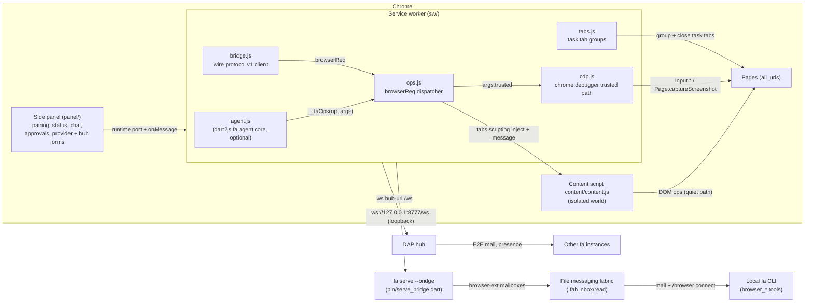

# Browser extension (`browser_ext/`)

How the [fa](../README.md) agent drives a real Chrome: a Chrome MV3
extension (`browser_ext/`) paired with a local `fa` over a loopback
WebSocket bridge, or running the whole fa agent core **inside** the
extension's service worker. This page is the operational guide — build,
pair, drive, test. The extension's own README
([browser_ext/README.md](../browser_ext/README.md)) covers the same ground
from inside the directory; tool availability config lives in
[docs/tool-availability.md](tool-availability.md).

## Overview — two operating modes

| | **Bridge mode** (default) | **Self-contained mode** |
|---|---|---|
| Where the agent runs | A local `fa` CLI process | Inside the extension's service worker (`sw/agent.js`, dart2js build of `browser_ext/dart/`) |
| Link | `ws://127.0.0.1:<port>/ws` (loopback only) | None — no CLI, no bridge needed |
| Provider config | Whatever the CLI already uses | Side-panel **Provider** form → `chrome.storage.local` (`faProvider`) |
| Tools | The eleven `browser_*` tools + the CLI's full toolset | `browser_*` ops over the same op table + core fs tools over `chrome.storage` — **no shell** |
| Approvals | CLI's approval gate | Panel approval banner (Allow/Deny, 30 s timeout = deny) |
| DAP hub | CLI's hub plugin | Extension's own hub client (`dap_peers`/`dap_dm`) |

Both modes can run side by side: a checkout without `sw/agent.js` is a
fully functional bridge-only scaffold, and building the agent
(`scripts/build_browser_ext.sh`) enables self-contained mode without
touching the bridge path.

## Architecture



Load order in the service worker is fixed (`sw/main.js`):
`tabs.js` → `bridge.js` → `ops.js` → `cdp.js` → `agent.js` (optional —
absent means scaffold mode, embedded agent disabled). Everything is a
classic script on the `globalThis.faSw` namespace; MV3 classic service
workers have no ES modules and dart2js output is classic too.

## Build & load

```bash
bash scripts/build_browser_ext.sh
```

The script:

1. Validates `browser_ext/manifest.json` (python3/node/grep fallback).
2. **dart2js step** — with a Dart SDK on `PATH`: `cd browser_ext/dart &&
   dart pub get && dart compile js -O2 -o ../sw/agent.js agent_main.dart`
   (side files `agent.js.deps`/`.map` are deleted). Without dart: a
   prebuilt `sw/agent.js` ships if present, else the build warns and
   produces a scaffold-only zip (bridge mode still works; never a build
   failure — but CI always builds the agent).
3. Zips the runtime files into `build/fa-extension.zip`
   (`manifest.json`, `sw/`, `content/`, `panel/` — README, `dart/`
   sources, `test/`, and `.map`/`.deps` stay out). Uses `zip`, falls back
   to a python3 `zipfile` script. Runs green on ubuntu-latest and macOS.

Load it:

1. Open `chrome://extensions`, enable **Developer mode**.
2. **Load unpacked** → select the `browser_ext/` directory (dev checkout;
   `sw/agent.js` is gitignored — run the build script first if you want
   self-contained mode). For a store zip, load/unpack
   `build/fa-extension.zip`.
3. Open the side panel: the extension puzzle-piece icon →
   *fa — browser agent*.

Minimum Chrome 116 (MV3 `sidePanel`). Permissions: `storage`, `tabs`,
`scripting`, `sidePanel`, `alarms`, `debugger`, `tabGroups`, host
`<all_urls>`.

## Pairing (bridge mode)

1. In the `fa` REPL run **`/browser connect`** (bare default; optional
   `port`). It starts the bridge inside the CLI process if it is not
   running (default port 8777, `ws://127.0.0.1:8777/ws`) and **mints a
   fresh one-time token** — 32 secure random bytes as 64 hex chars. The
   command prints the ws URL + token; paste both into the panel
   (**Bridge URL**, **One-time token**) and press **Connect**.
2. Handshake: the service worker sends
   `hello {agentId, proto:1, token, caps}`; on `welcome` the panel dot
   turns teal and the CLI's `browser_*` tools become available.
3. `/browser status` shows whether the bridge runs, the connected
   extensions, and the fabric mailboxes. `/browser connect [port]` on a
   running bridge only rotates the token.

The standalone server form is equivalent — useful when the bridge should
outlive a REPL session:

```bash
fa serve --bridge [--port N] [--token T]
```

**Token file.** Without `--token`, the server resolves the token from
`<projectRoot>/.fah/bridge/token`, minting it if absent; the file is
written mode 0600 (best-effort chmod — dart:io has no portable mode API,
so Windows/failed chmods keep default ACLs, like the hub identity key).
Tokens are compared in constant time.

**Rotation.** Every `/browser connect` (and every bridge restart without
a valid file token) mints a NEW token; earlier tokens stop working at the
next handshake. Already-connected extensions stay connected — only new
handshakes need the current token.

**State machine** (issue #23 E16; `sw/bridge.js`). `disconnected` →
`connecting` → `connected`; a dropped socket goes to `reconnecting` with
1 s doubling backoff capped at 30 s (a `chrome.alarms` keepalive re-arms
ping and retries after service-worker restarts; 20 s ping, stale after
two missed pongs). Two failures are **terminal**: a rejected token
(`bad_token`, close code 4401) and a protocol version mismatch. The
panel then shows `disconnected — bad token — run /browser connect again`
— the only recovery is re-running `/browser connect` and pairing again
with the fresh token. While offline, outgoing fabric mail queues (100
frames, drained oldest-first after `welcome`); inbound frame ids are
deduped in an LRU window of 512.

## Self-contained mode (embedded agent)

`scripts/build_browser_ext.sh` compiles `browser_ext/dart/agent_main.dart`
(package `fa_browser_agent`, path dep on the repo) into `sw/agent.js`;
`sw/main.js` feature-detects `globalThis.faAgent` after `importScripts`
and boots it with the stored config. The host
(`browser_ext/dart/src/agent_host.dart`) runs the real core `Agent`:
streaming provider, tool registry, `ApprovalManager`, JSONL session
persistence, auto-compaction.

- **Provider form.** Panel → **Provider** section → Base URL, API key,
  Model → **Save provider**. Any OpenAI-compatible chat-completions
  endpoint works. Config lands in `chrome.storage.local` (`faProvider`)
  and is read ONLY inside the service worker (AC8 — see
  [Security](#security-model)).
- **`fake:*` provider.** A model id starting with `fake:` selects a
  deterministic scripted provider — no network. It echoes the prompt, and
  a prompt containing `navigate <url>` makes it emit one
  `browser_navigate` tool call, so the whole loop
  (stream → approval → tool → result) is observable without an LLM. CI
  drives `faAgent.selfTest()` — one scripted fake turn against the real
  op table, asserting the tool result lands in the transcript.
- **Approval mode.** The same form sets the mode (`ask`, `write`,
  `yolo`, `unattended`). In `ask`/`write`, exec/write-tier calls render
  an Allow/Deny banner in the panel; no answer within 30 s denies and the
  model sees the refusal.
- **Sessions & compaction.** The transcript persists as JSONL
  (`/session.jsonl`) inside a versioned snapshot of the agent's whole
  in-memory filesystem in `chrome.storage.local` (`faFs`, debounced
  ~800 ms, flushed after every run; corrupt/missing snapshot = clean
  start). When Chrome reaps the service worker and later re-wakes it,
  the session resumes where it left off and compaction stays active.
- **No shell.** `exec` answers `shellUnavailable`; the `browser_*` tools
  (plus core read/write/edit/ls over the storage env) are the action
  surface. Self-contained mode exposes the full op table including
  `browser_task_end`.

## The `browser_*` tools (bridge mode)

Defined in `lib/src/browser/browser_tools.dart` over an injectable
`BrowserController` (the CLI wires it to the paired extension through
`bin/fah.dart`'s bridge handle; every op is a `browserReq` correlated
with a `browserRes`, 30 s dispatch timeout). Every tool is **exec tier**
and every tool takes the optional `tabId` pin (ids come from
`browser_tabs` / `browser_navigate` results; omit for the active tab).
Restricted pages (chrome://, Chrome Web Store, extension pages, PDF
viewer) fail with `restricted_page` on every tool.

| Tool | Args | Notes |
|---|---|---|
| `browser_navigate` | `url` (required), `tabId` | Returns tab id + final URL + title; without `tabId` opens a new tab that joins the task group. |
| `browser_tabs` | — | Lists id, url, title, ACTIVE flag, tab group. |
| `browser_switch_tab` | `tabId` (required) | Activates the tab and focuses its window. |
| `browser_click` | `selector` (required), `tabId` | Run `browser_read_dom` first. `trusted: true` → CDP path. |
| `browser_type` | `selector`, `text` (required), `submit`, `tabId` | `submit: true` presses Enter. `trusted: true` → CDP path. |
| `browser_press_key` | `key` (required), `selector`, `tabId` | Enter, Tab, Escape, Backspace, Delete, arrows, Home/End, PageUp/PageDown. `trusted: true` → CDP path. |
| `browser_select` | `selector`, `value` (required), `tabId` | Content path only. |
| `browser_read_dom` | `selector`, `maxNodes` (default 500, max 5000), `includeShadow`, `tabId` | Serialized DOM where every element carries its CSS selector; `nodeCount`/`truncated` say when to narrow. |
| `browser_eval` | `code` (required), `tabId` | JS in the page's **isolated world**; a returned Promise is awaited. |
| `browser_screenshot` | `tabId` | PNG saved under `generated/browser-<epochMs>.png` and returned inline; `trusted: true` → any-tab capture. |
| `browser_wait_for` | `selector` xor `text`, `timeoutMs` (default 10000, max 30000), `tabId` | Use after navigation/clicks that trigger async updates. |

Failures throw `BrowserToolException` carrying the wire error code in the
message (`no_target`, `node_vanished`, `restricted_page`, `timeout`,
`bad_args`, `denied`, …) so the model can read and react. Results from
DOM ops say which control plane ran (`path: "dom"` or `"cdp"`).

The op table (`sw/ops.js`) has one more op, `task_end` — not a model
tool in bridge mode: the service worker runs it when the bridge
disconnects, closing exactly the tabs the agent opened (task tab group
`fa — <task uuid>`; user-opened tabs are never touched). Several paired
extensions: the newest handshake wins, deterministically.

### Availability gating

The family rides the issue #19 availability system
([docs/tool-availability.md](tool-availability.md)):

- Family id **`browser`** covers all eleven tools; **`browser_eval`** is
  its own extra id so in-page JS evaluation can be disabled without
  hiding the rest of the family.
- The host's hard capability floor is `browserController.attached` — on
  the CLI, an extension paired on the bridge. Without it, BOTH ids are
  hidden live (the prompt is rebuilt) with the reason
  `no browser extension connected — run /browser connect and pair`; a
  bridge disconnect hides them the same way.
- Config (`tools:` scopes) can only turn present tools OFF, as with any
  other family.

## CDP trusted path (chrome.debugger)

Pages are driven over two control planes:

- **Content script (default, quiet).** Isolated-world DOM ops
  (`content/content.js`): synthetic `MouseEvent`/`KeyboardEvent`s, no UI
  change in the target tab. A page can in principle tell these from real
  user input.
- **CDP (per-call opt-in).** Pass `trusted: true` to `browser_click`,
  `browser_type`, `browser_press_key`, or `browser_screenshot`. Events go
  through `chrome.debugger` (`Input.dispatchMouseEvent` /
  `Input.dispatchKeyEvent`, protocol 1.3) — Chrome itself synthesizes
  them, indistinguishable from real user input. Attach is lazy per tab
  and cached; sessions drop on `task_end`, when another client takes the
  target, or when Chrome suspends the service worker.

**Honesty signal.** While a debugger session is open, Chrome shows the
*"… started debugging this browser"* infobar. That banner is by design:
the user can always see when the trusted path is in use. The quiet path
shows nothing.

**Conflict (E23).** If DevTools (or any other client) already owns the
tab, the op answers `{ ok: false, code: "denied" }` with a hint to retry
without `trusted` — the quiet content path still works there. The trusted
request is never silently downgraded to the content path.

**Screenshots: any tab vs `captureVisibleTab`.** The quiet path
(`chrome.tabs.captureVisibleTab`) needs the tab visible — the op
activates the tab first if needed. The trusted path
(`Page.captureScreenshot` over the debugger session) captures ANY tab —
active or not, no activation, no visibility (issue #23 AC16). Background
tabs therefore require `trusted: true`.

## DAP hub (agent-to-agent messaging)

The extension can join the same [DAP/1](dap.md) hub local `fa` instances
use — other agents see it via `dap_peers`, DM it (`dap_dm` steers it
mid-run), and get replies, end-to-end encrypted (ChaCha20-Poly1305 under
X25519 ECDH; the hub only ever sees ciphertext).

- **Panel hub settings.** Side panel → **Hub** section → Hub URL (e.g.
  `ws://127.0.0.1:8787/ws`) + display name → **Save hub**. Config is
  `chrome.storage.local` `faDap` (`{url, name}`); empty url = no hub.
  Status is one quiet line: `hub: connected as <agentId>` /
  `hub: disconnected (retrying)` (backoff 1 s → 30 s).
- **Identity.** Ed25519/X25519 keypair generated on first start,
  persisted in `chrome.storage.local` (`faDapKey`) in the CLI-compatible
  key-file format — export stays byte-compatible with `~/.dap`. The
  agentId is `hex(sha256(pubkey))[:16]`, stable across service-worker
  restarts.
- **Tools.** `dap_peers` (read tier) lists who is online;
  `dap_dm {to, text}` (exec tier) sends an E2E DM to a 16-hex id or a
  unique online name. The client speaks hello/send/whois/presence/flush
  only — Channels v1 is not implemented (no channel key store in the
  extension).
- **Dedupe vs bridge mail.** Inbound DMs arrive as `[from <agentId>]`
  mail — the same intake as bridge mail, and one shared `MailDeduper`
  (LRU 512) dedupes across both links, so a peer message arriving on the
  bridge AND the hub is delivered once (issue #23 AC18; bridge copy
  wins). A payload that cannot be decrypted surfaces as
  `[hub] undecryptable message from <from>` — never dropped, never shown
  as plaintext.

## Security model

- **Loopback only.** The bridge binds `127.0.0.1` — a non-loopback
  address throws before listening (AC15). WebSocket upgrades from a
  non-null origin that is not `chrome-extension://` get HTTP 403, so
  page JS can never reach the bridge.
- **One-time tokens.** 32 secure random bytes per `/browser connect`;
  constant-time compared, and rotated on every connect (a rotated-out
  token fails the next handshake; an unrotated one re-pairs fine until
  then). Stored `.fah/bridge/token` (0600) and, extension-side, in
  `chrome.storage.local`.
- **Keys never enter page worlds (AC8).** The provider API key is read
  from `chrome.storage.local` by the Dart agent inside the service
  worker only — never the panel, never content scripts, never pages.
  Content scripts run in the isolated world and cannot reach the
  WebSocket, the token, or bridge state; `browser_eval` runs isolated
  too, so a page's CSP may block it (`csp` error) by design.
- **Restricted targets** (chrome://, Web Store, extension pages, PDF
  viewer) are refused before any interaction (`restricted_page`).
- **No shell** in self-contained mode (`shellUnavailable`).
- **Store-listing redaction.** `build/fa-extension.zip` ships runtime
  files only, no secrets — but the panel UI *displays* token/key fields
  and the event log: any screenshots taken for a Chrome Web Store
  listing must be taken against a scratch profile and must not show a
  real pairing token, API key, or hub traffic.

## Testing

Three layers, cheapest first:

1. **Pure Dart (no browser).** `dart test test/browser/` — wire protocol
   (`bridge_protocol_test.dart`), bridge server + pairing
   (`serve_bridge_test.dart`), `/browser` surface
   (`browser_connect_test.dart`), tool family over a fake controller
   (`browser_tools_test.dart`).
2. **Extension units.**
   - `cd browser_ext/dart && dart pub get && dart test` — the dart2js
     package's pure slice: DAP identity round-trip, agentId derivation,
     frame signatures, E2E DM crypto, backoff table, mail dedupe
     (`test/dap_frames_test.dart`). The js_interop WebSocket transport is
     exercised end-to-end in layer 3, not here.
   - `node --test browser_ext/test/` (Node 22) — `ops_trusted.test.mjs`
     and `cdp_smoke.test.mjs` drive the real `ops.js`/`cdp.js` in a
     `node:vm` sandbox against a stubbed `chrome` (trusted routing,
     E23 denied, restricted pages, version skew).
3. **Headless Chrome E2E (integration).** `test/browser_ext/` launches a
   real Chrome with the extension loaded and exercises the whole path
   (extension load + agent self-test, fixture task, bridge E2E, DAP E2E)
   — tagged `@Tags(['integration'])`, so the default `dart test` run
   skips it. Run it locally:

   ```bash
   bash scripts/build_browser_ext.sh
   dart test test/browser_ext/ --tags integration
   ```

   Chrome flags used by the suite's driver: `--headless=new`,
   `--disable-gpu`, `--remote-debugging-port=0`,
   `--user-data-dir=<mkdtemp>`, `--no-first-run`,
   `--no-default-browser-check`, `--load-extension=<abs>/browser_ext`
   (plus `--no-sandbox --disable-dev-shm-usage` on Linux). The binary is
   resolved from `CHROME_PATH`, else PATH
   (`google-chrome` → `google-chrome-stable` → `chromium` →
   `chromium-browser`); a missing binary fails loudly. CI runs the same
   suite in `.github/workflows/browser-ext.yml` (path-filtered +
   `workflow_dispatch`, jobs serialized with `-j 1`).

## Safari (AC12)

Chrome-first today. The documented conversion path (a `chrome.*`-API MV3
extension converts mechanically; the `chrome.debugger` and `sidePanel`
surfaces used here are the risk areas to verify):

- [ ] **Convert:**
      `xcrun safari-web-extension-converter browser_ext --project-location build --app-name fa-browser-agent --bundle-identifier dev.fa1.browser-ext`
      (add `--no-open` to skip Xcode auto-open). Keep the Swift/no
      background-app defaults the tool proposes; the extension resources
      are copied verbatim.
- [ ] **Project settings.** In the generated Xcode project: enable
      **Allow Running Extensions Asynchronously**; in the app target's
      Signing & Capabilities confirm App Safari Extensions
      (`com.apple.SafariWebExtension`), and Safari ≥ 16.4 as deployment
      target (side panel parity).
- [ ] **Entitlements.** The bridge is `ws://127.0.0.1` — App Sandbox
      builds need the network entitlements
      (`com.apple.security.network.client` at minimum, plus
      `com.apple.security.network.server` if the embedded-agent mode
      should ever accept inbound loopback links). Without the client
      entitlement the WebSocket fails with a sandbox denial, not a
      protocol error.
- [ ] **`chrome.*` surface audit.** `chrome.debugger` has no Safari
      equivalent — the trusted path must degrade honestly (expect the
      `denied`/unsupported mapping, keep the quiet content path as the
      only control plane). Verify `chrome.tabGroups`, `chrome.alarms`
      keepalives, and `chrome.storage.session` availability.
- [ ] **Build & sign.** Build the generated project with `xcodebuild`
      (the converter names the scheme after `--app-name`), then sign the
      containing app with a Developer ID Application certificate
      (`codesign --deep --force`); Safari requires the containing app to
      be signed even for local use, and the extension must be enabled in
      Safari Settings → Extensions.
- [ ] **Re-run layer 2/3 suites** against the converted build where
      applicable (the node `vm` tests are browser-independent; the
      headless Chrome suite stays Chrome-only).

**Status: documented, execution pending macOS.** The converter requires
Xcode on macOS; every step above is unexecuted on this Linux checkout —
do not treat the checklist as verified.

## Roadmap / non-goals (issue #23)

Out of scope for this phase, explicitly:

- **Native Messaging** (stretch goal) — a `chrome.runtime.connectNative`
  host would remove the WebSocket hop; the bridge contract stays the
  fallback.
- **Workflow recorder** — recording user interactions into replayable
  task scripts.
- **Firefox** — the MV3 surface used here (`sidePanel`, `debugger`
  semantics, service-worker lifetime) is Chrome-specific today.
