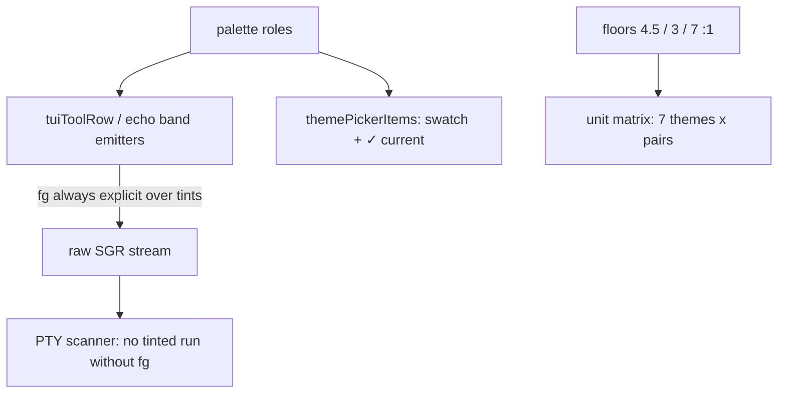

### What changed
Fixed TUI theme readability (gh-671) and verified it end to end. Text over theme-painted backgrounds always carries an explicit, floor-checked foreground now: failed tool rows render in `userMessageText` (the terminal-default fg was invisible over ohmypi-light's light pink/red tint bands — the screenshot bug), done-row detail drops the unpredictable SGR-2 dim flag, and the transcript echo band re-renders with bg **and** fg after theme switches/resizes.

### Key decisions
- Contrast floors are code, not convention: `kThemeBodyTextFloor` (4.5:1), `kThemeSecondaryTextFloor` (3:1), `kThemeUserMessageFloor` (7:1) + `themeColorContrast`/`themeReferenceTerminalBg` exported from `tui_theme.dart`; unit tests enforce the full rendered-pair matrix for all 7 built-ins.
- Palette values adjusted at the source for failing roles (each tagged `// gh-671 readability:`): nord muted/toolOutput/toolErrorBg, dracula toolOutput, ohmypi-dark muted/toolOutput, pi muted/toolOutput, ohmypi-light toolOutput, default toolOutput gained an explicit fg. `tui_theme_palette.dart` header documents the deliberate vendor deltas.
- `/theme` picker: every row keeps its swatch and the current theme gets a success-colored `✓ current` text marker (the old picker replaced the swatch with a dim `(current)` string); `_rearmSelection` now also wraps plain selected labels in the accent so the cursor row is visible in every palette.
- Theme goldens extended to all 7 built-ins (nord + dracula added); regenerated for the explicit-fg rendering.

### How to verify
```bash
dart test test/cli/tui_theme_test.dart test/cli/tui_role_sweep_test.dart test/cli/fa_tui_fuzzy_roles_test.dart
dart test --tags integration test/integration/theme_readability_pty_test.dart
```
The PTY suite mocks the LLM and drives real scenarios (successful bash, failing bash, `/theme <name>` switch, bare `/theme` picker) across dracula/nord/ohmypi-light, asserting via an SGR state machine that no tinted text run renders without an explicit foreground.

<details><summary>Architecture</summary>


</details>
